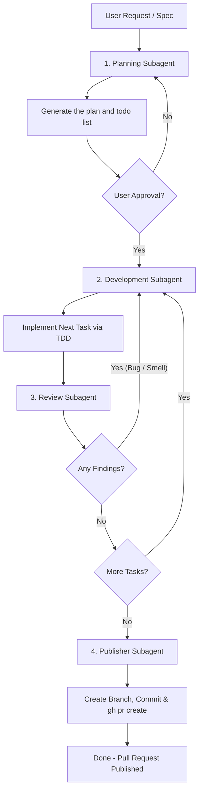

# Multi-Agent Iteration Loop

<!-- SYNC: mirrored in dmc-268-{ui,api}-t6/.agents/agents/dev-loop.md -->

This agent coordinates four independent agents (`planning`, `development`, `review`, and
`publisher`) in a continuous loop to deliver and publish spec-compliant, standard-abiding
features.

## Workflow Execution Steps

> [!IMPORTANT]
> **Coordinator Constraint**: This agent MUST NOT write implementation code, create source
> files, or modify files in the codebase directly during the development phase. It is solely
> responsible for planning, orchestrating the loop, conducting code reviews, and managing
> publishing. All code changes and task implementations MUST be delegated to spawned
> subagents, each given a brief file path rather than a retyped copy of context.

### 1. Planning Phase

- **Spawn the `planning` subagent** to read the user request/specification and codebase
  structure.
- The `planning` agent writes a plan file and a todo list, for example
  `docs/plans/<issue>-plan.md` and `docs/plans/<issue>-todo.md`.
- Once the plan is saved, present it to the user for feedback and approval.

### 2. Development Phase (Task Implementation)

- **Select the first incomplete task** from the todo list.
- **Spawn the `development` subagent** to implement that task: failing test first, minimum
  code to pass, verify compile checks and execution results, then mark the task done in the
  todo list.

### 3. Review Phase (Quality Gates)

- **Spawn the `review` subagent** to audit the branch's git diff for standards and spec; it
  outputs findings under `## Standards` and `## Spec` headers.
- **If there are findings**: send them to the `development` subagent, have it resolve them,
  then rerun the `review` agent.
- **If there are 0 findings**: move to the next incomplete task (back to Step 2), or proceed
  to Step 4 once all tasks are done.

### 4. Publishing Phase (Deployment Gate)

- **Spawn the `publisher` subagent** to verify `git status`, stage, commit with Conventional
  Commits, push, and run `gh pr create` with standard metadata.
- Return the direct URL of the pull request.

## Exit Criteria

- All tasks in the todo list are marked done.
- The `review` agent reports 0 standard violations or spec omissions.
- All unit and integration tests in the test suite pass successfully.
- The `publisher` agent has successfully pushed and opened a pull request, sharing its URL.

## Sub-Agent Skill References

- **Planning Sub-Agent**: the planning-and-task-breakdown skill
  (`.agents/skills/planning-and-task-breakdown/SKILL.md`, added by a later task in this issue)
  — analyzes dependencies, partitions slices, and outputs plans.
- **Development Sub-Agent**: incremental, vertical-slice implementation (see the stack rules
  file in `.agents/rules/`), plus the tdd skill (`.agents/skills/tdd/SKILL.md`, added by a
  later task in this issue) for test-first RED-GREEN loops at public boundaries.
- **Review Sub-Agent**: [code-review](../skills/code-review/SKILL.md) — two-axis checks for
  standard and spec compliance.
- **Publisher Sub-Agent**: [pull-request](../skills/pull-request/SKILL.md) — automates git
  checkout, commits, pushes, and `gh pr create`.
