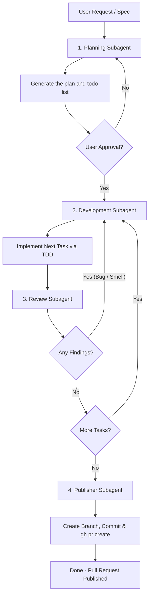

# Multi-Agent Iteration Loop

<!-- SYNC: mirrored in dmc-268-{ui,api}-t6/.agents/skills/agent-loop/SKILL.md -->

This skill coordinates four independent agents (`planning`, `development`, `review`, and
`publisher`) in a continuous loop to deliver and publish spec-compliant, standard-abiding
features.

## Workflow Execution Steps

> [!IMPORTANT]
> **Coordinator Constraint**: The coordinator agent executing this skill MUST NOT write
> implementation code, create source files, or modify files in the codebase directly during
> the development phase. The coordinator is solely responsible for planning, orchestrating the
> loop, conducting code reviews, and managing publishing. All code changes and task
> implementations MUST be delegated to the spawned subagents.

### 1. Planning Phase

- **Spawn the `planning` subagent** to read the user request/specification and codebase
  structure.
- The `planning` agent writes a plan file (architecture, design, tasks) and a todo list, for
  example `docs/plans/<issue>-plan.md` and `docs/plans/<issue>-todo.md`.
- Once the plan is saved, present it to the user for feedback and approval.

### 2. Development Phase (Task Implementation)

- **Select the first incomplete task** from the todo list.
- **Spawn the `development` subagent** to implement that task.
- The `development` agent must:
  - Operate incrementally, writing a failing unit test first.
  - Implement only enough code to pass the test.
  - Verify compile checks and execution results.
  - Mark the task done in the todo list.

### 3. Review Phase (Quality Gates)

- **Spawn the `review` subagent** to perform standard and spec audits on the branch's git diff.
- The `review` agent outputs findings under `## Standards` and `## Spec` headers.
- **Evaluate results**:
  - **If there are findings** (e.g., hard violations or baseline smells):
    - Send a message to the `development` subagent containing the reviewer's report.
    - Instruct the developer to resolve the bugs or smells.
    - Rerun the `review` agent once the developer has updated the branch.
  - **If there are 0 findings**:
    - Check the todo list for the next incomplete task.
    - If tasks remain, loop back to **Step 2**.
    - If all tasks are completed, proceed to **Step 4**.

### 4. Publishing Phase (Deployment Gate)

- **Spawn the `publisher` subagent** to automate the integration and deployment lifecycle.
- The `publisher` agent must:
  - Verify `git status` and stage all changed files.
  - Commit files using the Conventional Commits syntax and push to origin.
  - Execute `gh pr create` with standard metadata titles/descriptions to open the pull request.
  - Return the direct URL link to the pull request.

## Exit Criteria

- All tasks in the todo list are marked done.
- The `review` agent reports 0 standard violations or spec omissions.
- All unit and integration tests in the test suite pass successfully.
- The `publisher` agent has successfully pushed and opened a pull request, sharing its URL.

## Sub-Agent Skill References

To ensure execution consistency, each sub-agent in this loop is dedicated to executing a
specific workspace skill. They must load and re-use the following guides:

- **Planning Sub-Agent**: the planning-and-task-breakdown skill
  (`.agents/skills/planning-and-task-breakdown/SKILL.md`, added by a later task in this issue)
  — analyzes dependencies, partitions slices, and outputs plans.
- **Development Sub-Agent**: incremental, vertical-slice implementation (see the stack rules
  file in `.agents/rules/`), plus the tdd skill (`.agents/skills/tdd/SKILL.md`, added by a
  later task in this issue) for test-first RED-GREEN loops at public boundaries.
- **Review Sub-Agent**: [code-review](../code-review/SKILL.md) — performs two-axis checks for
  standard compliance and specification compliance.
- **Publisher Sub-Agent**: [pull-request](../pull-request/SKILL.md) — automates git checkout,
  commits, pushes, and GitHub CLI PR creation.
