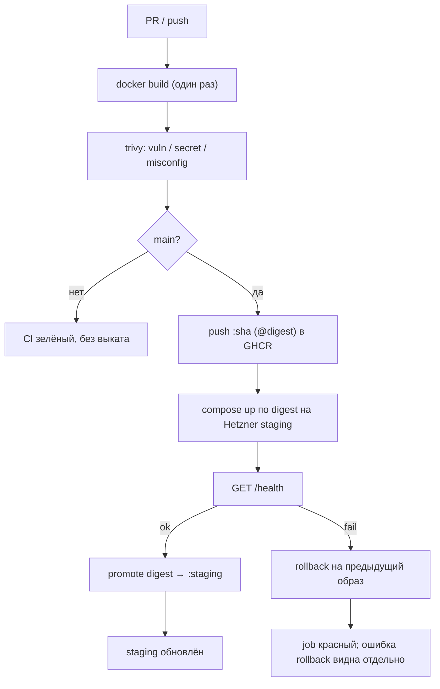

# CI/CD — Web UI (команда 6)

|                     |                                                                                                                               |
| ------------------- | ----------------------------------------------------------------------------------------------------------------------------- |
| Статус              | рабочий каркас пайплайна                                                                                                      |
| Владелец            | инфраструктура (роль 3)                                                                                                       |
| Связанные документы | `SYSTEM_DESIGN.md` (§14), инфраструктура в репозитории [dmc-268-api-t6](https://github.com/larchanka-training/dmc-268-api-t6) |

Пайплайн собирает статический React UI в OCI-образ, сканирует его и выкатывает на staging-VM в Hetzner Cloud. Реестр — **GitHub Container Registry**. Provisioning VM (Terraform, firewall, DNS) живёт только в **API-репозитории** (`terraform/ui-staging/`).

---

## 1. Конвейер



| Job                          | Когда                        | Что проверяет / делает                                                |
| ---------------------------- | ---------------------------- | --------------------------------------------------------------------- |
| `Docker image build`         | PR и `main`                  | один build, artifact для scan/push                                    |
| `Docker image security scan` | после сборки                 | Trivy того же artifact                                                |
| `Push Docker image`          | только `main`                | push `:sha`, resolve digest (тот же artifact, что прошёл Trivy)       |
| `Deploy staging`             | только `main`                | `docker compose` по digest на VM, внешний health check, авто-rollback |
| `Promote staging tag`        | после успешного health check | `:staging-previous` ← `:staging`; `:staging` ← проверенный digest     |
| `Rollback staging`           | `workflow_dispatch`          | откат контейнера + синхронизация `:staging`                           |

Ручной откат: workflow **Rollback staging** (`workflow_dispatch`). Пустой `image` → предыдущий успешный выкат; иначе тег или полный ref.

---

## 2. Образ и health check

Образ собирается через **pnpm** с frozen lockfile и слушает `:8080`. Контракт живости:

```http
GET /health
200 {"status":"ok","service":"dmc-268-ui"}
```

После `compose up --wait` runner дергает тот же URL снаружи (`STAGING_HEALTH_URL` или `http://$STAGING_HOST/health`, 12 попыток × 5 с). Если ответ не `ok` — на VM запускается `rollback.sh`, job падает.

---

## 3. Container Registry

| Параметр               | Значение                                                                                      |
| ---------------------- | --------------------------------------------------------------------------------------------- |
| Host                   | `ghcr.io`                                                                                     |
| Repository             | `ghcr.io/<owner>/dmc-268-ui-t6`                                                               |
| Auth CI (push/promote) | `GITHUB_TOKEN`, `packages: write` только на runner                                            |
| Auth staging pull      | `GITHUB_TOKEN` с `packages: read`; credential удаляется после `docker pull`                   |
| Теги                   | `:<git-sha>` + `@sha256:…` (deploy), `:staging` (текущий), `:staging-previous` (точка отката) |

Deploy и rollback на VM получают read-only token; promotion `:staging` выполняется отдельным job на GitHub runner **только после** успешного health check.

---

## 4. Staging (Hetzner)

VM для UI поднимается Terraform-стеком `terraform/ui-staging/` в репозитории **dmc-268-api-t6**:

- private network `10.20.0.0/16` + subnet `10.20.1.0/24`
- firewall: 80, 443, ICMP; SSH только из `ssh_allowed_cidrs`
- Debian 12 + Docker / Compose через cloud-init
- каталог `/opt/dmc-268-ui` на VM

### SSH и runner со static egress

`ubuntu-latest` имеет **динамический** egress IP. Firewall Terraform разрешает SSH только из `ssh_allowed_cidrs`, поэтому deploy/rollback jobs **не могут** работать на GitHub-hosted runner без открытия SSH на `0.0.0.0/0`.

**Требования:**

1. Self-hosted runner или GitHub larger runner с **фиксированным исходящим IP** (или VPN/private network до VM).
2. Egress IP runner'а добавлен в `ssh_allowed_cidrs` Terraform-стека `ui-staging` (см. [INFRASTRUCTURE.md](https://github.com/larchanka-training/dmc-268-api-t6/blob/main/docs/INFRASTRUCTURE.md) в API-репозитории).
3. Узнать фактический egress: с runner выполнить `curl -4 ifconfig.me` (или `curl -4 https://api.ipify.org`) и записать `/32` в Terraform.

Инструкции по `terraform apply`, DNS и remote state — [docs/INFRASTRUCTURE.md](https://github.com/larchanka-training/dmc-268-api-t6/blob/main/docs/INFRASTRUCTURE.md) в API-репозитории.

---

## 5. Rollback

1. **Автоматический.** Health check после выката не прошёл → `rollback.sh` поднимает образ из `.deploy-state.previous`. Тег `:staging` в GHCR не меняется до успешного health check.
2. **Ручной.** Actions → Rollback staging.
   - Пустой `image` — предыдущий успешный выкат (сначала `.deploy-state.previous` на VM, иначе `:staging-previous` в GHCR).
   - `staging-previous` / `abc123` / полный `ghcr.io/...@sha256:...` — конкретная версия.
   - Workflow **сначала** разрешает цель отката в immutable digest, **затем** выкатывает его на VM, **затем** после health check синхронизирует `:staging` и `:staging-previous`.
3. **Конкурентность.** Deploy и rollback делят группу `staging-deploy` без отмены друг друга.

---

## 6. GitHub configuration

### Repository / Organization Variables

`runs-on` вычисляется **до** запуска job, поэтому selector runner'а хранится на уровне **repository** или **organization**, а не Environment.

| Variable         | Где задать                                                                           | Назначение                                                               |
| ---------------- | ------------------------------------------------------------------------------------ | ------------------------------------------------------------------------ |
| `STAGING_RUNNER` | Repository или Organization → Settings → Secrets and variables → Actions → Variables | JSON-массив labels runner'а, например `["self-hosted","staging-static"]` |

Workflow использует `runs-on: ${{ fromJSON(vars.STAGING_RUNNER) }}` — каждый элемент массива становится отдельной label.

### Environment `staging`

#### Secrets

| Secret            | Назначение                                        |
| ----------------- | ------------------------------------------------- |
| `STAGING_SSH_KEY` | приватный ключ к `hcloud_ssh_key.ci` из Terraform |

#### Variables

| Variable                  | Назначение                                                        |
| ------------------------- | ----------------------------------------------------------------- |
| `STAGING_HOST`            | IPv4 или FQDN из Terraform output `ssh_host` (стек `ui-staging`)  |
| `STAGING_SSH_USER`        | пользователь с Docker (`root` после cloud-init)                   |
| `STAGING_SSH_FINGERPRINT` | SHA256 fingerprint хоста для appleboy `scp-action` / `ssh-action` |
| `STAGING_HEALTH_URL`      | необязательно; иначе `http://$STAGING_HOST/health`                |

`GITHUB_TOKEN` выдаёт Actions сам — в репозиторий его не кладут.

---

## 7. Локальные команды

```bash
docker build -t dmc-268-ui:local .
trivy image --severity CRITICAL,HIGH --exit-code 1 dmc-268-ui:local
docker run --rm -p 8080:8080 dmc-268-ui:local
curl -fsS http://127.0.0.1:8080/health
```
