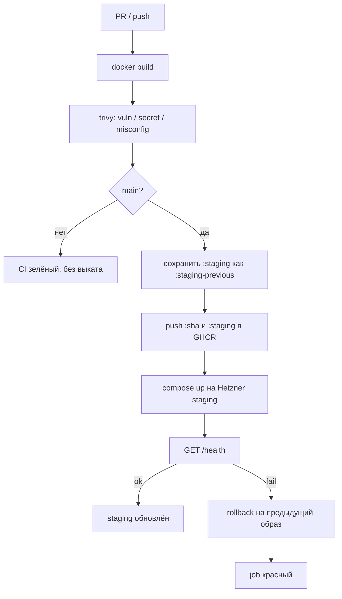

# CI/CD — Web UI (команда 6)

| | |
|---|---|
| Статус | рабочий каркас пайплайна |
| Владелец | инфраструктура (роль 3) |
| Связанные документы | `SYSTEM_DESIGN.md` (§14), инфраструктура в репозитории [dmc-268-api-t6](https://github.com/larchanka-training/dmc-268-api-t6) |

Пайплайн собирает статический React UI в OCI-образ, сканирует его и выкатывает на staging-VM в Hetzner Cloud. Реестр — **GitHub Container Registry**. Provisioning VM (Terraform, firewall, DNS) живёт только в **API-репозитории** (`terraform/ui-staging/`).

---

## 1. Конвейер



| Job | Когда | Что проверяет / делает |
|---|---|---|
| `Docker image build` | PR и `main` | multi-stage образ `node` → `nginx-unprivileged` |
| `Docker image security scan` | после сборки | Trivy: `CRITICAL`/`HIGH`, scanners `vuln,secret,misconfig` |
| `Push Docker image` | только `main` | login в `ghcr.io`, сохранение прошлого `:staging`, push `:sha` и `:staging` |
| `Deploy staging` | только `main` | `docker compose` на VM, внешний health check, авто-rollback |

Ручной откат: workflow **Rollback staging** (`workflow_dispatch`). Пустой `image` → предыдущий успешный выкат; иначе тег или полный ref.

---

## 2. Образ и health check

Образ слушает `:8080` и отдаёт UI из `dist/`. Контракт живости:

```http
GET /health
200 {"status":"ok","service":"dmc-268-ui"}
```

После `compose up --wait` runner дергает тот же URL снаружи (`STAGING_HEALTH_URL` или `http://$STAGING_HOST/health`, 12 попыток × 5 с). Если ответ не `ok` — на VM запускается `rollback.sh`, job падает.

---

## 3. Container Registry

| Параметр | Значение |
|---|---|
| Host | `ghcr.io` |
| Repository | `ghcr.io/<owner>/dmc-268-ui-t6` |
| Auth CI | `GITHUB_TOKEN`, `packages: write` |
| Auth staging pull | тот же token, только на время `docker pull` |
| Теги | `:<git-sha>` (неизменяемый), `:staging` (текущий), `:staging-previous` (точка отката) |

---

## 4. Staging (Hetzner)

VM для UI поднимается Terraform-стеком `terraform/ui-staging/` в репозитории **dmc-268-api-t6**:

- private network `10.20.0.0/16` + subnet `10.20.1.0/24`
- firewall: 80, 443, ICMP; SSH только из `ssh_allowed_cidrs`
- Debian 12 + Docker / Compose через cloud-init
- каталог `/opt/dmc-268-ui` на VM

Инструкции по `terraform apply`, DNS и remote state — [docs/INFRASTRUCTURE.md](https://github.com/larchanka-training/dmc-268-api-t6/blob/main/docs/INFRASTRUCTURE.md) в API-репозитории.

---

## 5. Rollback

1. **Автоматический.** Health check после выката не прошёл → `rollback.sh` поднимает образ из `.deploy-state.previous`.
2. **Ручной.** Actions → Rollback staging. Пустой image = previous; `staging-previous` / `abc123` / полный `ghcr.io/...@sha256:...` = конкретная версия.
3. **Конкурентность.** Deploy и rollback делят группу `staging-deploy` без отмены друг друга.

---

## 6. GitHub Environment `staging`

### Secrets

| Secret | Назначение |
|---|---|
| `STAGING_SSH_KEY` | приватный ключ к `hcloud_ssh_key.ci` из Terraform |

### Variables

| Variable | Назначение |
|---|---|
| `STAGING_HOST` | IPv4 или FQDN из Terraform output `ssh_host` (стек `ui-staging`) |
| `STAGING_SSH_USER` | пользователь с Docker (`root` после cloud-init) |
| `STAGING_HEALTH_URL` | необязательно; иначе `http://$STAGING_HOST/health` |

`GITHUB_TOKEN` выдаёт Actions сам — в репозиторий его не кладут.

---

## 7. Локальные команды

```bash
docker build -t dmc-268-ui:local .
trivy image --severity CRITICAL,HIGH --exit-code 1 dmc-268-ui:local
docker run --rm -p 8080:8080 dmc-268-ui:local
curl -fsS http://127.0.0.1:8080/health
```
