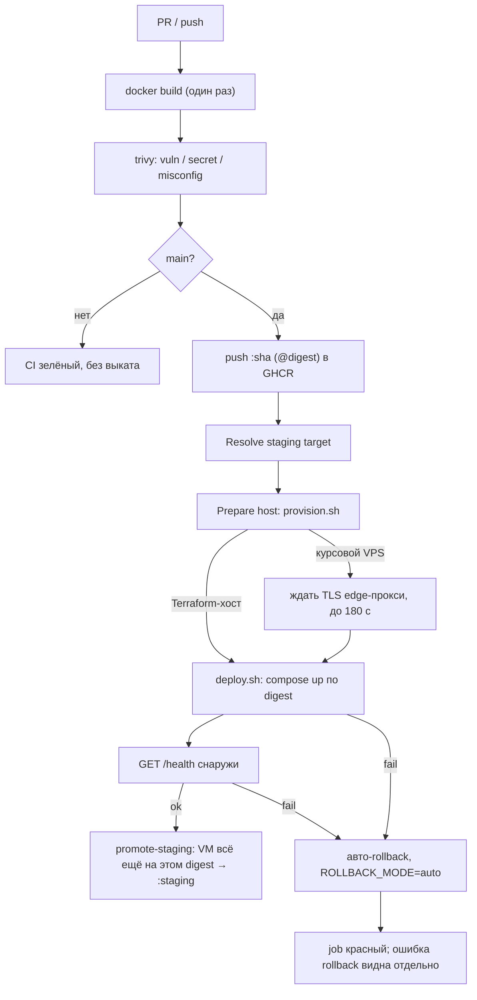

# CI/CD — Web UI (команда 6)

|                     |                                                                                                                                                                                                                                                                                                                                                                |
| ------------------- | -------------------------------------------------------------------------------------------------------------------------------------------------------------------------------------------------------------------------------------------------------------------------------------------------------------------------------------------------------------- |
| Статус              | рабочий каркас пайплайна                                                                                                                                                                                                                                                                                                                                       |
| Владелец            | инфраструктура (роль 3)                                                                                                                                                                                                                                                                                                                                        |
| Связанные документы | `SYSTEM_DESIGN.md` (§14); в репозитории [dmc-268-api-t6](https://github.com/larchanka-training/dmc-268-api-t6): [CICD.md](https://github.com/larchanka-training/dmc-268-api-t6/blob/main/docs/CICD.md) (edge-прокси), [INFRASTRUCTURE.md](https://github.com/larchanka-training/dmc-268-api-t6/blob/main/docs/INFRASTRUCTURE.md) (Terraform-стек `ui-staging`) |

Пайплайн собирает статический React UI в OCI-образ, сканирует его и выкатывает на staging. Реестр — **GitHub Container Registry**. Цель выката — общий курсовой VPS за edge-прокси (по умолчанию) или отдельный Terraform-хост в Hetzner Cloud (§2). Edge-прокси, Terraform-стек `terraform/ui-staging/` и DNS живут только в **API-репозитории**: этот репозиторий их не выкатывает и `terraform apply` не делает.

---

## 1. Конвейер



| Job                           | Когда                              | Permissions                                                                                            | Что делает                                                                                                                                                                                     |
| ----------------------------- | ---------------------------------- | ------------------------------------------------------------------------------------------------------ | ---------------------------------------------------------------------------------------------------------------------------------------------------------------------------------------------- |
| `Docker image build`          | PR и `main`                        | `contents: read`                                                                                       | один build, artifact для scan/push                                                                                                                                                             |
| `Docker image security scan`  | после сборки                       | `contents: read`                                                                                       | Trivy того же artifact                                                                                                                                                                         |
| `Push Docker image`           | только `main`                      | `contents: read`, `packages: write`, `actions: read`                                                   | push `:sha`, resolve digest (тот же artifact, что прошёл Trivy)                                                                                                                                |
| `Deploy staging`              | только `main`                      | `contents: read`, `packages: read`                                                                     | выбор цели (§2), подготовка хоста, Compose по digest, внешний health check, авто-rollback при ошибке deploy или health                                                                         |
| `Promote staging tag`         | после успешного health check       | `contents: read`, `packages: write`                                                                    | под lock `staging-deploy` читает `.deploy-state` на VM (без токена); если там всё ещё этот digest — `:staging-previous` ← `:staging`, `:staging` ← проверенный digest, иначе warning и пропуск |
| `Rollback staging` (workflow) | `workflow_dispatch`, только `main` | `rollback`: `contents: read`, `packages: read`; `promote-staging`: `contents: read`, `packages: write` | откат на VM, проверка снаружи, синхронизация `:staging` (§6)                                                                                                                                   |

Корневые permissions: `contents: read`, остальное — только у job, которому нужно. Все jobs работают на `ubuntu-latest`.

Шаги `Deploy staging`: **Resolve staging target** → копирование `deploy/` в `APP_DIR` (`appleboy/scp-action`) → **Prepare host** → (курсовой VPS) ожидание TLS → **Deploy image** (`deploy.sh`) → **Health check** → при ошибке **Rollback on failed deploy or health check** (`ROLLBACK_MODE=auto`) → job красный.

**Prepare host** переименовывает `staging*.yml` в `compose.yml`, `compose.ports.yml`, `compose.edge.yml` и запускает `provision.sh` (копия из API-репозитория) с `APP_DIR` и `EDGE_NETWORK` (`dmc268-edge` только на курсовом VPS): при необходимости ставит Docker и Compose из пакетов Debian (под `flock` вместе с прогонами API), создаёт `APP_DIR` и сеть `dmc268-edge`. Workflow Rollback делает то же перед откатом.

---

## 2. Две цели выката

Шаг **Resolve staging target** в `deploy-staging`, `promote-staging` и Rollback выбирает цель. Хост, порт, способ входа, `APP_DIR`, режим публикации и URL во всех шагах берутся только из него.

|                             | Курсовой VPS                                                                              | Terraform / Hetzner                                                                                                                |
| --------------------------- | ----------------------------------------------------------------------------------------- | ---------------------------------------------------------------------------------------------------------------------------------- |
| Когда                       | `STAGING_HOST` пуст                                                                       | задан `STAGING_HOST`                                                                                                               |
| SSH                         | `VPS_DMC268_IP_T6`:22, `VPS_DMC268_U` + пароль `VPS_DMC268_P`                             | `STAGING_HOST`:`STAGING_SSH_PORT` (Terraform output `ssh_port`, по умолчанию `22022`), `STAGING_SSH_USER` + ключ `STAGING_SSH_KEY` |
| Host key                    | repository variable `STAGING_SSH_FINGERPRINT`                                             | тот же variable (значение Environment `staging` перекрывает repository)                                                            |
| `APP_DIR` / compose project | `/opt/dmc-268-ui-staging` / `dmc-268-ui-staging`                                          | `/opt/dmc-268-ui` / `dmc-268-ui`                                                                                                   |
| Публикация UI               | без host-порта: сеть `dmc268-edge`, alias `ui-staging`, порт 8080 (`compose.edge.yml`)    | host-порт `80:8080` (`compose.ports.yml`), без edge                                                                                |
| URL / health                | `https://staging-ui.<APP_DOMAIN>`, `/health`                                              | `http://<STAGING_HOST>`, `/health` (или `STAGING_HEALTH_URL`)                                                                      |
| Docker                      | ставит `provision.sh` при первом прогоне                                                  | из cloud-init; `provision.sh` ничего не ставит                                                                                     |
| Bootstrap до первого выката | нет; после отката без previous — nginx в `dmc268-edge` с alias `ui-staging`, слушает 8080 | `dmc-268-ui-bootstrap` из cloud-init на `:80`                                                                                      |

- `key` уходит только на Terraform-хост, пароль — только на VPS, и только как input `appleboy/*` (в скрипты на хосте он не передаётся).
- `STAGING_SSH_FINGERPRINT` обязателен для обеих целей, формат `SHA256:<43 символа base64>`. С пустым fingerprint appleboy принимает любой host key, поэтому job с SSH падает первым шагом. Значения цели проверяются на одну строку, URL — на `http(s)://` без пробелов.
- При переключении цели (задать или очистить `STAGING_HOST`) обновите `STAGING_SSH_FINGERPRINT`: при несовпадении host key все SSH-шаги падают, выката на чужой хост не будет.
- `APP_DIR` Terraform-хоста менять нельзя: cloud-init держит `dmc-268-ui-bootstrap` на `:80`, а `deploy.sh` снимает контейнер `<compose project>-bootstrap`. С другим именем проекта bootstrap останется на порту 80, и `compose up` упадёт.
- SSH Terraform-хоста открыт миру намеренно: у GitHub-hosted runners нет стабильных egress IP. Защита — нестандартный порт, вход только по ключу и fail2ban ([INFRASTRUCTURE.md, §4.1](https://github.com/larchanka-training/dmc-268-api-t6/blob/main/docs/INFRASTRUCTURE.md#41-ssh-доступ)). Курсовой VPS общий: там порт 22 и пароль, sshd и firewall не меняем.

---

## 3. Edge-прокси (курсовой VPS)

Caddy (compose project `dmc-268-edge`) принимает 80/443 на VPS, выпускает сертификаты Let's Encrypt и маршрутизирует по имени хоста.

- **Владелец — API-репозиторий.** Этот репозиторий прокси не выкатывает и `deploy/edge/` не копирует. Маршруты меняются PR в `deploy/edge/Caddyfile` API-репозитория.
- **Контракт UI:** контейнер подключён к внешней docker-сети `dmc268-edge` с alias `ui-staging` и слушает `8080`; host-порты на VPS не публикуются (80/443 заняты прокси).
- Все вызовы Compose идут с `-p <basename APP_DIR>`: имя проекта не берётся из compose-файла, и UI не пересекается с API на общем VPS.
- `DEPLOY_MODE` (`edge|ports`) и `EDGE_ALIAS` сохраняются в `<APP_DIR>/.env`; `rollback.sh` читает их оттуда.
- Перед выкатом (и перед Rollback) job до 180 с ждёт успешного TLS-рукопожатия с `https://staging-ui.<APP_DOMAIN>/` (любой HTTP-статус, 502 тоже). Без сертификата job падает до изменений на хосте, поэтому медленный первый выпуск в Let's Encrypt не запускает авто-rollback.

| Hostname (`APP_DOMAIN` = `dmc268-t6.axyi.ru`) | Upstream в `dmc268-edge` | Статус                                   |
| --------------------------------------------- | ------------------------ | ---------------------------------------- |
| `staging-ui.<APP_DOMAIN>`                     | `ui-staging:8080`        | выкатывает этот репозиторий              |
| `ui.<APP_DOMAIN>`                             | `ui-prod:8080`           | маршрут есть, prod-выката пока нет → 502 |

Пока upstream не запущен, маршрут отвечает 502, остальные маршруты прокси работают.

---

## 4. Образ и health check

Образ собирается через **pnpm** с frozen lockfile и слушает `:8080`. Контракт живости:

```http
GET /health
200 {"status":"ok","service":"dmc-268-ui"}
```

После `compose up --wait` runner проверяет URL из резолвера снаружи, 12 попыток × 5 с: курсовой VPS — `https://staging-ui.<APP_DOMAIN>/health` через edge-прокси; Terraform-хост — `STAGING_HEALTH_URL` или `http://<STAGING_HOST>/health`. Не `ok` → авто-rollback, job красный. Bootstrap nginx `/health` не отдаёт: после отката на bootstrap проверяется `GET <base_url>/` с HTTP 200.

---

## 5. Container Registry и доступ с VM

| Параметр               | Значение                                                                                                                |
| ---------------------- | ----------------------------------------------------------------------------------------------------------------------- |
| Host                   | `ghcr.io`                                                                                                               |
| Repository             | `ghcr.io/<owner>/dmc-268-ui-t6`                                                                                         |
| Auth CI (push/promote) | `GITHUB_TOKEN`; `packages: write` только у `push-image` и двух `promote-staging`, на runner. На VM этот токен не уходит |
| Auth staging pull      | `GITHUB_TOKEN` с `packages: read`, только на время выката или отката                                                    |
| Теги                   | `:<git-sha>` + `@sha256:…` (deploy), `:staging` (текущий), `:staging-previous` (точка отката)                           |

На VM `deploy.sh` логинится в GHCR во временный `DOCKER_CONFIG` (`mktemp -d`), а не в `/root/.docker/config.json`: выкаты API и UI под общим root на курсовом VPS не мешают друг другу. Сразу после `compose up` — `docker logout`, при выходе каталог удаляется (trap). `rollback.sh`, запущенный из `deploy.sh`, использует тот же каталог и его логин; запущенный отдельно — создаёт и удаляет свой.

---

## 6. Rollback

`rollback.sh` работает в одном из режимов `ROLLBACK_MODE`; другое значение — отказ до любых изменений.

1. **Автоматический (`ROLLBACK_MODE=auto`).** Запускается из `deploy.sh`, если упал `compose up`, и шагом **Rollback on failed deploy or health check**, если не прошёл health check. Поднимает образ из `.deploy-state.previous` и **не** записывает упавший образ в previous: повторный откат не вернёт сломанный релиз. Без previous: если выкатов ещё не было — восстанавливается bootstrap; если первый релиз уже записан в `.deploy-state` (упал только внешний health check) — откат отказывается (exit 1), релиз остаётся работать, job красный. Тег `:staging` не меняется.
2. **Ручной (`ROLLBACK_MODE=manual`, по умолчанию).** Actions → **Rollback staging** → Run workflow, ветка `main`. С другой ветки jobs пропускаются до входа в Environment `staging`, а run не встаёт в группу `staging-deploy` (своя группа `rollback-ignored-<run_id>`).
   - `reason` — обязателен.
   - Пустой `image` — предыдущий релиз: `.deploy-state.previous` на VM, иначе `:staging-previous` из GHCR, иначе bootstrap. Релиз, с которого откатились, становится новым previous (как `:staging` → `:staging-previous`).
   - Конкретная версия — полный 40-символьный git SHA (→ `ghcr.io/<owner>/dmc-268-ui-t6:<sha>`), `sha256:<64 hex>` или полный `ghcr.io/<owner>/dmc-268-ui-t6:<полный sha>` / `…@sha256:<digest>`. Короткий SHA, `staging-previous`, `latest`, другой реестр или репозиторий, значение с переводом строки job отклоняет до SSH.
   - Цель разрешается в immutable digest, выкатывается на VM и проверяется снаружи (§4).
   - Затем job читает с VM `.deploy-state` (строка `current_image=…` или маркер `bootstrap=true`) и продвигает в `:staging` только образ, который реально запущен и совпадает с целью; прежний `:staging` → `:staging-previous`. Promotion принимает только `ghcr.io/<owner>/dmc-268-ui-t6` с `:<полный sha>` или `@sha256:<digest>`. Bootstrap — без promotion, job зелёный. Расхождение — job красный, `:staging` не меняется.

На VM вручную (break-glass):

```bash
read -rs GHCR_TOKEN && export GHCR_TOKEN GHCR_USER=<github-user>   # PAT с read:packages, не попадает в history
APP_DIR=/opt/dmc-268-ui-staging /opt/dmc-268-ui-staging/rollback.sh          # курсовой VPS, previous release
/opt/dmc-268-ui/rollback.sh ghcr.io/<owner>/dmc-268-ui-t6@sha256:<digest>    # Terraform-хост, конкретный образ
```

Без `APP_DIR` скрипт берёт `/opt/dmc-268-ui`. Пакет в GHCR приватный: без `GHCR_TOKEN` `docker pull` упадёт.

---

## 7. Конкурентность: группа `staging-deploy`

В группе `staging-deploy` (`cancel-in-progress: false`) стоят job `deploy-staging`, job `promote-staging` (CI/CD) и весь run **Rollback staging** с `main`. Выполняющийся job не отменяется. Lock снимается между deploy и promotion, поэтому ручной rollback может пройти между ними: promotion под lock читает образ на VM, видит другой digest и не перезаписывает `:staging` (warning в job).

GitHub держит в группе concurrency один выполняющийся и **только один ожидающий** run/job: когда в группу встаёт следующий, прежний ожидающий отменяется. Ожидающий **Rollback staging** отменится, если следом встанет deploy из нового push в `main`, и наоборот. Отменённая promotion безопасна: `:staging` просто не меняется.

Runbook:

1. Кто держит и ждёт группу: Actions → незавершённые runs **CI/CD** и **Rollback staging** (у job в очереди — ожидание concurrency group). Из CLI:

   ```bash
   gh run list --limit 20 --json databaseId,workflowName,headBranch,event,status,createdAt \
     --jq '.[] | select(.status != "completed")'
   gh run view <run-id>   # jobs и их статус
   ```

2. Отменить лишний ожидающий run (например, deploy, который перезатрёт нужный rollback): Actions → run → **Cancel workflow** или `gh run cancel <run-id>`.
3. Перезапустить отменённый run: Actions → run → **Re-run all jobs** или `gh run rerun <run-id>`; для Rollback можно запустить новый Run workflow.

На инцидент:

1. Заморозить merge в `main`.
2. Запустить **Rollback staging** (ветка `main`).
3. Если run показал `cancelled` — перезапустить (шаг 3 выше).
4. Снять заморозку после зелёного rollback и внешней проверки.

---

## 8. GitHub configuration

### Organization — курсовой VPS

Заданы курсом на уровне организации, одинаковы в репозиториях API и UI.

| Имя                | Тип      | Зачем                                                       |
| ------------------ | -------- | ----------------------------------------------------------- |
| `VPS_DMC268_IP_T6` | variable | IPv4 курсового VPS, SSH на порт 22                          |
| `VPS_DMC268_U`     | secret   | SSH-пользователь                                            |
| `VPS_DMC268_P`     | secret   | SSH-пароль; уходит только на VPS, никогда на Terraform-хост |
| `AI_DMC268_T6`     | secret   | LLM-ключ приложения; CI его не использует                   |

### Repository variables

Заводит владелец репозитория.

| Variable                  | Обязателен            | Значение                                                                                                                                                                          |
| ------------------------- | --------------------- | --------------------------------------------------------------------------------------------------------------------------------------------------------------------------------- |
| `STAGING_SSH_FINGERPRINT` | да, для обеих целей   | `SHA256:…` ECDSA host key VPS: `ssh-keyscan -t ecdsa -p 22 <VPS_DMC268_IP_T6> 2>/dev/null \| ssh-keygen -lf - -E sha256`. Значение в Environment `staging` перекрывает repository |
| `APP_DOMAIN`              | да, для курсового VPS | `dmc268-t6.axyi.ru` — базовый домен маршрутов edge-прокси                                                                                                                         |

### Environment `staging`

Jobs `deploy-staging`, `promote-staging` (CI/CD) и workflow Rollback ссылаются на `environment: staging`.

1. **Deployment branches and tags** → только `main`. Rollback и сам пропускает jobs вне `refs/heads/main`, но branch policy закрывает secrets environment для любой другой ветки и workflow.
2. **Required reviewers — не включать.** `deploy-staging` и `promote-staging` оба входят в `staging`, поэтому каждый выкат запросил бы подтверждение дважды, а job, ожидающий подтверждения, возможно, держит группу `staging-deploy` и блокирует rollback (не проверено). Контроль — branch policy `main` и review PR.
3. Secrets и variables нужны только для Terraform-хоста (для курсового VPS хватает organization и repository значений):

| Имя                       | Тип      | Значение                                                                                                              |
| ------------------------- | -------- | --------------------------------------------------------------------------------------------------------------------- |
| `STAGING_SSH_KEY`         | secret   | приватный ключ к `hcloud_ssh_key.ci` из Terraform                                                                     |
| `STAGING_HOST`            | variable | IPv4 или FQDN из Terraform output `ssh_host` (стек `ui-staging`); пусто → курсовой VPS                                |
| `STAGING_SSH_PORT`        | variable | Terraform output `ssh_port` (`22022`); без него jobs с SSH падают первым шагом                                        |
| `STAGING_SSH_USER`        | variable | пользователь с Docker (`root` после cloud-init)                                                                       |
| `STAGING_SSH_FINGERPRINT` | variable | ECDSA host key Terraform-хоста: `ssh-keyscan -t ecdsa -p <ssh_port> <host> 2>/dev/null \| ssh-keygen -lf - -E sha256` |
| `STAGING_HEALTH_URL`      | variable | необязательно; иначе `http://<STAGING_HOST>/health`                                                                   |

`GITHUB_TOKEN` выдаёт Actions сам — в репозиторий его не кладут. `ACTIONS_STEP_DEBUG` / `ACTIONS_RUNNER_DEBUG` для `staging` не включать: отладочные логи могут повторить переданные на SSH переменные.

---

## 9. Локальные команды

```bash
docker build -t dmc-268-ui:local .
trivy image --severity CRITICAL,HIGH --exit-code 1 dmc-268-ui:local
docker run --rm -p 8080:8080 dmc-268-ui:local
curl -fsS http://127.0.0.1:8080/health
```
