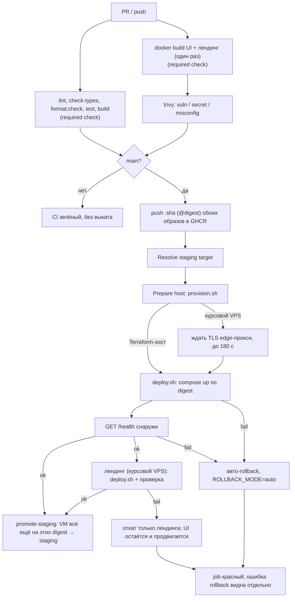

# CI/CD — Web UI (команда 6)

|                     |                                                                                                                                                                                                                                                                                                                                                                                                                                                                          |
| ------------------- | ------------------------------------------------------------------------------------------------------------------------------------------------------------------------------------------------------------------------------------------------------------------------------------------------------------------------------------------------------------------------------------------------------------------------------------------------------------------------ |
| Статус              | рабочий каркас пайплайна                                                                                                                                                                                                                                                                                                                                                                                                                                                 |
| Владелец            | инфраструктура (роль 3)                                                                                                                                                                                                                                                                                                                                                                                                                                                  |
| Связанные документы | в репозитории [dmc-268-api-t6](https://github.com/larchanka-training/dmc-268-api-t6): [SYSTEM_DESIGN.md](https://github.com/larchanka-training/dmc-268-api-t6/blob/main/docs/SYSTEM_DESIGN.md#14-развёртывание-v1) (§14), [CICD.md](https://github.com/larchanka-training/dmc-268-api-t6/blob/main/docs/CICD.md) (edge-прокси), [INFRASTRUCTURE.md](https://github.com/larchanka-training/dmc-268-api-t6/blob/main/docs/INFRASTRUCTURE.md) (Terraform-стек `ui-staging`) |

Пайплайн прогоняет гейты качества, собирает статический React UI и публичный лендинг (`landing/`) в два OCI-образа, сканирует их и выкатывает на staging. Реестр — **GitHub Container Registry**. Цель выката — общий курсовой VPS за edge-прокси (по умолчанию) или отдельный Terraform-хост в Hetzner Cloud (§2); лендинг выкатывается только на курсовой VPS (§4.1). Edge-прокси, Terraform-стек `terraform/ui-staging/` и DNS живут только в **API-репозитории**: этот репозиторий их не выкатывает и `terraform apply` не делает.

---

## 1. Конвейер


```mermaid
flowchart TD
  pr["PR / push"] --> quality["lint, check-types, format:check, test, build<br/>(required check)"]
  pr --> build["docker build UI + лендинг (один раз)<br/>(required check)"]
  build --> scan["trivy: vuln / secret / misconfig"]
  quality --> gate{"main?"}
  scan --> gate
  gate -->|нет| stop["CI зелёный, без выката"]
  gate -->|да| push["push :sha (@digest) обоих образов в GHCR"]
  push --> target["Resolve staging target"]
  target --> prep["Prepare host: provision.sh"]
  prep -->|Terraform-хост| deploy["deploy.sh: compose up по digest"]
  prep -->|курсовой VPS| tls["ждать TLS edge-прокси, до 180 с"]
  tls --> deploy
  deploy --> health["GET /health снаружи"]
  health -->|ok| landing["лендинг (курсовой VPS): deploy.sh + проверка"]
  health -->|ok| promote["promote-staging: VM всё ещё на этих digest → :staging"]
  landing -->|ok| promote
  landing -->|fail| rbl["откат только лендинга; UI остаётся и продвигается"]
  rbl --> fail
  health -->|fail| rb["авто-rollback, ROLLBACK_MODE=auto"]
  deploy -->|fail| rb
  rb --> fail["job красный; ошибка rollback видна отдельно"]
```

| Job                           | Когда                              | Permissions                                                                                            | Что делает                                                                                                                                                                                                                                                                                                                |
| ----------------------------- | ---------------------------------- | ------------------------------------------------------------------------------------------------------ | ------------------------------------------------------------------------------------------------------------------------------------------------------------------------------------------------------------------------------------------------------------------------------------------------------------------------- |
| `UI quality`                  | PR и `main`                        | `contents: read`                                                                                       | гейты качества: `pnpm lint`, `pnpm check-types`, `pnpm format:check`, `pnpm test`, `pnpm build`, `pnpm verify:prod-bundle`; required check в правилах `main` (§8)                                                                                                                                                         |
| `Docker image build`          | PR и `main`                        | `contents: read`                                                                                       | один build UI (`Dockerfile`) и один лендинга (`landing/Dockerfile`), artifacts для scan/push                                                                                                                                                                                                                              |
| `Docker image security scan`  | после сборки                       | `contents: read`                                                                                       | Trivy тех же artifacts, обоих образов                                                                                                                                                                                                                                                                                     |
| `Push Docker image`           | только `main`                      | `contents: read`, `packages: write`, `actions: read`                                                   | push `:sha` обоих образов, resolve digest (те же artifacts, что прошли Trivy)                                                                                                                                                                                                                                             |
| `Deploy staging`              | только `main`                      | `contents: read`, `packages: read`                                                                     | выбор цели (§2), подготовка хоста, Compose по digest, внешний health check; на курсовом VPS следом лендинг (§4.1); авто-rollback при ошибке deploy или health, сбой лендинга откатывает только лендинг                                                                                                                    |
| `Promote staging tag`         | после успешного health check UI    | `contents: read`, `packages: write`                                                                    | под lock `staging-deploy` читает `.deploy-state` UI и лендинга на VM (без токена); если там всё ещё эти digest — `:staging-previous` ← `:staging`, `:staging` ← проверенный digest для каждого образа (лендинг — только если прошёл и он), иначе warning и пропуск; если `:staging` уже на этом digest, теги не трогаются |
| `Rollback staging` (workflow) | `workflow_dispatch`, только `main` | `rollback`: `contents: read`, `packages: read`; `promote-staging`: `contents: read`, `packages: write` | откат UI и/или лендинга на VM, проверка снаружи, синхронизация `:staging` (§6)                                                                                                                                                                                                                                            |

Корневые permissions: `contents: read`, остальное — только у job, которому нужно. Все jobs работают на `ubuntu-latest`.

`UI quality` ставит Node.js 24 (как build-стадия `Dockerfile`) и pnpm версии из `packageManager`, затем выполняет `pnpm install --frozen-lockfile` и шесть гейтов по порядку (последний, `pnpm verify:prod-bundle`, идёт после `pnpm build` и проверяет `dist/assets`: нет mock/demo-кода, а вызов zod `jitless` исполняется раньше первой схемы); первый упавший шаг делает job красным. Job стоит в `needs` у `Push Docker image`: с красными гейтами образ не пушится и staging не выкатывается. На PR job отменяется вместе со всем run при новом push в ветку (`cancel-in-progress` в `concurrency` workflow). Лимит job — 15 минут (`timeout-minutes`): зависший прогон не держит обязательную проверку и `Push Docker image` до стандартных шести часов.

Шаги `Deploy staging`: **Resolve staging target** → копирование `deploy/` в `APP_DIR` (`appleboy/scp-action`; на курсовом VPS ещё файлы лендинга в его `APP_DIR`) → **Prepare host** → (курсовой VPS) ожидание TLS → **Deploy image** (`deploy.sh`) → **Health check** → (курсовой VPS) **Deploy landing image** → **Landing health check** → при ошибке лендинга **Rollback landing on failed deploy or health check**, при ошибке UI **Rollback on failed deploy or health check** (оба `ROLLBACK_MODE=auto`, каждый откатывает только свою часть) → job красный, в логе `::error::` с тем, что упало. После сбоя лендинга `Promote staging tag` всё равно продвигает проверенный UI (`!cancelled()` и флаг `promote`), тег лендинга не двигается (`promote_landing=false`).

**Prepare host** переименовывает `staging*.yml` в `compose.yml`, `compose.ports.yml`, `compose.edge.yml` и запускает `provision.sh` (копия из API-репозитория) с `APP_DIR` и `EDGE_NETWORK` (`dmc268-edge` только на курсовом VPS): при необходимости ставит Docker и Compose из пакетов Debian (под `flock` вместе с прогонами API), создаёт `APP_DIR` и сеть `dmc268-edge`. Workflow Rollback делает то же перед откатом.

---

## 2. Две цели выката

Шаг **Resolve staging target** в `deploy-staging`, `promote-staging` и Rollback выбирает цель. Хост, порт, способ входа, `APP_DIR`, режим публикации и URL во всех шагах берутся только из него.

|                             | Курсовой VPS                                                                                                                                                                | Terraform / Hetzner                                                                                                                |
| --------------------------- | --------------------------------------------------------------------------------------------------------------------------------------------------------------------------- | ---------------------------------------------------------------------------------------------------------------------------------- |
| Когда                       | `STAGING_HOST` пуст                                                                                                                                                         | задан `STAGING_HOST`                                                                                                               |
| SSH                         | `VPS_DMC268_IP_T6`:22, `VPS_DMC268_U` + пароль `VPS_DMC268_P`                                                                                                               | `STAGING_HOST`:`STAGING_SSH_PORT` (Terraform output `ssh_port`, по умолчанию `22022`), `STAGING_SSH_USER` + ключ `STAGING_SSH_KEY` |
| Host key                    | repository variable `STAGING_SSH_FINGERPRINT`                                                                                                                               | тот же variable (значение Environment `staging` перекрывает repository)                                                            |
| `APP_DIR` / compose project | `/opt/dmc-268-ui-staging` / `dmc-268-ui-staging`                                                                                                                            | `/opt/dmc-268-ui` / `dmc-268-ui`                                                                                                   |
| Публикация UI               | без host-порта: сеть `dmc268-edge`, alias `ui-staging`, порт 8080 (`compose.edge.yml`)                                                                                      | host-порт `80:8080` (`compose.ports.yml`), без edge                                                                                |
| URL / health                | `https://staging-ui.<APP_DOMAIN>`, `/health`                                                                                                                                | `http://<STAGING_HOST>`, `/health` (или `STAGING_HEALTH_URL`)                                                                      |
| Docker                      | ставит `provision.sh` при первом прогоне                                                                                                                                    | из cloud-init; `provision.sh` ничего не ставит                                                                                     |
| Bootstrap до первого выката | нет; после отката UI без previous — nginx в `dmc268-edge` с alias `ui-staging`, слушает 8080. У лендинга bootstrap нет: без previous его стек только останавливается (§4.1) | `dmc-268-ui-bootstrap` из cloud-init на `:80`                                                                                      |
| Лендинг                     | `APP_DIR` `/opt/dmc-268-landing-staging` (compose project `dmc-268-landing-staging`), сеть `dmc268-edge`, alias `landing-staging`, `https://staging.<APP_DOMAIN>` (§4.1)    | не выкатывается: хост отдаёт только UI на `:80`                                                                                    |

- `key` уходит только на Terraform-хост, пароль — только на VPS, и только как input `appleboy/*` (в скрипты на хосте он не передаётся).
- `STAGING_SSH_FINGERPRINT` обязателен для обеих целей, формат `SHA256:<43 символа base64>`. С пустым fingerprint appleboy принимает любой host key, поэтому job с SSH падает первым шагом. Значения цели проверяются на одну строку, URL — на `http(s)://` без пробелов.
- При переключении цели (задать или очистить `STAGING_HOST`) обновите `STAGING_SSH_FINGERPRINT`: при несовпадении host key все SSH-шаги падают, выката на чужой хост не будет.
- `APP_DIR` Terraform-хоста менять нельзя: cloud-init держит `dmc-268-ui-bootstrap` на `:80`, а `deploy.sh` снимает контейнер `<compose project>-bootstrap`. С другим именем проекта bootstrap останется на порту 80, и `compose up` упадёт.
- SSH Terraform-хоста открыт миру намеренно: у GitHub-hosted runners нет стабильных egress IP. Защита — нестандартный порт, вход только по ключу и fail2ban ([INFRASTRUCTURE.md, §4.1](https://github.com/larchanka-training/dmc-268-api-t6/blob/main/docs/INFRASTRUCTURE.md#41-ssh-доступ)). Курсовой VPS общий: там порт 22 и пароль, sshd и firewall не меняем.

---

## 3. Edge-прокси (курсовой VPS)

Caddy (compose project `dmc-268-edge`) принимает 80/443 на VPS, выпускает сертификаты Let's Encrypt и маршрутизирует по имени хоста.

- **Владелец — API-репозиторий.** Этот репозиторий прокси не выкатывает и `deploy/edge/` не копирует. Маршруты меняются PR в `deploy/edge/Caddyfile` API-репозитория.
- **Контракт UI:** контейнер подключён к внешней docker-сети `dmc268-edge` с alias `ui-staging` и слушает `8080`; host-порты на VPS не публикуются (80/443 заняты прокси). Лендинг — так же, alias `landing-staging`.
- Все вызовы Compose идут с `-p <basename APP_DIR>`: имя проекта не берётся из compose-файла, и UI не пересекается с API на общем VPS.
- `DEPLOY_MODE` (`edge|ports`) и `EDGE_ALIAS` сохраняются в `<APP_DIR>/.env`; `rollback.sh` читает их оттуда.
- Перед выкатом (и перед Rollback) job до 180 с ждёт успешного TLS-рукопожатия с `https://staging-ui.<APP_DOMAIN>/` (любой HTTP-статус, 502 тоже). Без сертификата job падает до изменения запущенного релиза (файлы деплоя уже загружены, **Prepare host** уже выполнен), поэтому медленный первый выпуск в Let's Encrypt не запускает авто-rollback.

| Hostname (`APP_DOMAIN` = `dmc268-t6.axyi.ru`)      | Upstream в `dmc268-edge`                                     | Статус                                                                            |
| -------------------------------------------------- | ------------------------------------------------------------ | --------------------------------------------------------------------------------- |
| `staging-ui.<APP_DOMAIN>`                          | `/api/*` → `api-staging:8000`, остальное → `ui-staging:8080` | UI выкатывает этот репозиторий, `/api/*` — репозиторий API                        |
| `ui.<APP_DOMAIN>`                                  | `/api/*` → `api-prod:8000`, остальное → `ui-prod:8080`       | prod-выката пока нет → заглушка 503                                               |
| `staging.<APP_DOMAIN>`, `staging-www.<APP_DOMAIN>` | `landing-staging:8080`                                       | лендинг выкатывает этот репозиторий (§4.1)                                        |
| `<APP_DOMAIN>`, `www.<APP_DOMAIN>`                 | `landing-staging:8080`                                       | пока prod-выката нет — staging-лендинг; с prod-выкатом переедут на `landing-prod` |

Пока upstream не запущен, `staging-ui` отвечает 502, а `ui` и хосты лендинга — заглушкой 503 edge-прокси ([CICD.md API, §8.2](https://github.com/larchanka-training/dmc-268-api-t6/blob/main/docs/CICD.md#82-edge-прокси)); остальные маршруты прокси работают. Таблица выше — маршруты **после** выката PR в API-репозитории (api#240), который добавляет хосты лендинга. Сейчас, до него, у Caddy нет сайта и сертификата для `staging.`, `www.` и `staging-www.` (TLS-рукопожатие падает, curl exit 35), а основной домен `<APP_DOMAIN>` отвечает 301 → `ui.<APP_DOMAIN>`.

---

## 4. Образ и health check

Образ собирается через **pnpm** с frozen lockfile и слушает `:8080`. Контракт живости:

```http
GET /health
200 {"status":"ok","service":"dmc-268-ui"}
```

После `compose up --wait` runner проверяет URL из резолвера снаружи, 12 попыток × 5 с: курсовой VPS — `https://staging-ui.<APP_DOMAIN>/health` через edge-прокси; Terraform-хост — `STAGING_HEALTH_URL` или `http://<STAGING_HOST>/health`. Не `ok` → авто-rollback, job красный. Bootstrap nginx `/health` не отдаёт: после отката на bootstrap проверяется `GET <base_url>/` с HTTP 200.

### 4.1 Лендинг

Образ — `landing/Dockerfile` (контекст сборки — корень репозитория, там lockfile workspace): `pnpm --dir landing build`, затем тот же `nginxinc/nginx-unprivileged:1.30-alpine`, что у UI, с тем же обновлением пакетов, пользователем `nginx` и портом `8080`. Пакет в GHCR — `ghcr.io/<owner>/dmc-268-ui-t6-landing`, теги как у UI (§5).

```http
GET /health
200 {"status":"ok","service":"dmc-268-landing"}

GET /config.json
200 {"appUrl":"<APP_URL>"}   Cache-Control: no-cache
```

- **Адрес приложения задаётся при старте, не при сборке.** Переменная окружения `APP_URL` обязательна: `docker/landing/15-check-app-url.sh` пропускает только `http(s)://<host>[:port][/path]`, иначе контейнер не стартует (`compose up --wait` падает → авто-rollback). Затем шаг envsubst образа nginx пишет `/etc/nginx/runtime/config.json` из `docker/landing/config.json.template`; nginx отдаёт его как `/config.json` с `Cache-Control: no-cache`, так что новый `APP_URL` виден браузеру без ожидания кэша. Лендинг читает файл при загрузке; без файла берёт адрес по умолчанию из кода (контракт — `landing/src/lib/appUrl.ts` из PR #164 по #162; без него лендинг `/config.json` не читает, поэтому #164 мержится до этого PR или сразу за ним). Один образ годится для staging и prod.
- **Только курсовой VPS (режим `edge`).** На Terraform-хосте лендинга нет: хост выделен под UI на `:80`, своего маршрута для лендинга там нет. Образ всё равно собирается, сканируется и пушится на каждый `main`.
- **Выкат.** Те же `deploy.sh` / `rollback.sh`, свой `APP_DIR` `/opt/dmc-268-landing-staging`, compose project `dmc-268-landing-staging`, файлы `deploy/compose/landing.yml` и `landing.edge.yml`, alias `landing-staging`. `APP_URL` = `https://staging-ui.<APP_DOMAIN>` (URL UI из резолвера), сохраняется в `<APP_DIR>/.env` вместе с `IMAGE`, `DEPLOY_MODE`, `EDGE_ALIAS`.
- **Откат отдельно от UI.** Лендинг выкатывается после успешного health check UI того же коммита. Упал выкат или проверка лендинга — откатывается только лендинг (`ROLLBACK_MODE=auto`): исправный UI не пересоздаётся, его `:staging` продвигается, тег лендинга остаётся на прежнем релизе, job красный с `::error::` о лендинге. Так выкат приложения не зависит ни от лендинга, ни от маршрутов edge-прокси в API-репозитории.
- **Без previous — остановка, не bootstrap.** Шаги лендинга передают `NO_PREVIOUS_RELEASE=stop` (сохраняется в `<APP_DIR>/.env`, его читает и break-glass `rollback.sh`). Если упал первый релиз лендинга, его стек только останавливается: на хостах лендинга отвечает заглушка 503 edge-прокси, а не стоковая страница nginx. У UI по умолчанию `bootstrap`, как раньше.
- **Проверка снаружи** (`deploy/scripts/landing-healthcheck.sh`): `https://staging.<APP_DOMAIN>/health` (12 × 5 с, как у UI) и `/config.json` с ожидаемым `appUrl` (до 6 попыток с паузой 3 с). Пока маршруты лендинга (api#240) не выкачены, у Caddy нет сайта для `staging.<APP_DOMAIN>` и TLS-рукопожатие падает (curl exit 35). Это окно закрывает repository variable `LANDING_EDGE_ROUTED` (§8):
  - не задана или `false` — exit 35 пропускает проверку с warning, остаётся `compose up --wait` на VM;
  - `true` — exit 35 (нет сайта, не выпущен сертификат) валит проверку, как любая другая ошибка;
  - другое значение — отказ до любых изменений на хосте.

  Любой другой ответ проверяется строго в обоих режимах. Проверяется только `staging.` — собственный хост staging-лендинга; основной домен и `www.` переедут на `landing-prod` вместе с prod-выкатом, поэтому staging-проверку к ним не привязываем.

  Порядок выката: этот PR (контейнер `landing-staging` уже запущен) → PR api#240 (его выкат делает `caddy reload`) → проверить `curl -sS https://staging.<APP_DOMAIN>/config.json` → владелец репозитория ставит `LANDING_EDGE_ROUTED=true`. С этого момента поломка маршрута или сертификата лендинга делает job красным.

---

## 5. Container Registry и доступ с VM

| Параметр               | Значение                                                                                                                |
| ---------------------- | ----------------------------------------------------------------------------------------------------------------------- |
| Host                   | `ghcr.io`                                                                                                               |
| Repository             | `ghcr.io/<owner>/dmc-268-ui-t6` (UI), `ghcr.io/<owner>/dmc-268-ui-t6-landing` (лендинг)                                 |
| Auth CI (push/promote) | `GITHUB_TOKEN`; `packages: write` только у `push-image` и двух `promote-staging`, на runner. На VM этот токен не уходит |
| Auth staging pull      | `GITHUB_TOKEN` с `packages: read`, только на время выката или отката                                                    |
| Теги                   | у каждого образа: `:<git-sha>` + `@sha256:…` (deploy), `:staging` (текущий), `:staging-previous` (точка отката)         |

На VM `deploy.sh` логинится в GHCR во временный `DOCKER_CONFIG` (`mktemp -d`), а не в `/root/.docker/config.json`: выкаты API и UI под общим root на курсовом VPS не мешают друг другу. Сразу после `compose up` — `docker logout`, при выходе каталог удаляется (trap). `rollback.sh`, запущенный из `deploy.sh`, использует тот же каталог и его логин; запущенный отдельно — создаёт и удаляет свой.

---

## 6. Rollback

`rollback.sh` работает в одном из режимов `ROLLBACK_MODE`; другое значение — отказ до любых изменений.

1. **Автоматический (`ROLLBACK_MODE=auto`).** Запускается из `deploy.sh`, если упал `compose up`, и шагом **Rollback on failed deploy or health check**, если не прошёл health check. Поднимает образ из `.deploy-state.previous` и **не** записывает упавший образ в previous: повторный откат не вернёт сломанный релиз. Без previous восстанавливается bootstrap, `.deploy-state` и `.deploy-state.previous` удаляются — и когда выкатов ещё не было, и когда упал первый релиз (в том числе только на внешнем health check): упавший релиз не остаётся в `.deploy-state`, и следующий выкат не скопирует его в previous. Job красный, тег `:staging` не меняется. Лендинг откатывается так же, из своего `APP_DIR`, но без previous его стек только останавливается (`NO_PREVIOUS_RELEASE=stop`, §4.1); его ошибка UI не трогает.
2. **Ручной (`ROLLBACK_MODE=manual`, по умолчанию).** Actions → **Rollback staging** → Run workflow, ветка `main`. С другой ветки jobs пропускаются до входа в Environment `staging`, а run не встаёт в группу `staging-deploy` (своя группа `rollback-ignored-<run_id>`).
   - `reason` — обязателен.
   - Пустой `image` — предыдущий релиз: `.deploy-state.previous` на VM, иначе `:staging-previous` из GHCR, иначе bootstrap. Релиз, с которого откатились, становится новым previous (как `:staging` → `:staging-previous`).
   - Конкретная версия — полный 40-символьный git SHA (→ `ghcr.io/<owner>/dmc-268-ui-t6:<sha>`), `sha256:<64 hex>` или полный `ghcr.io/<owner>/dmc-268-ui-t6:<полный sha>` / `…@sha256:<digest>`. Короткий SHA, `staging-previous`, `latest`, другой реестр или репозиторий, значение с переводом строки job отклоняет до SSH.
   - Цель разрешается в immutable digest, выкатывается на VM и проверяется снаружи (§4).
   - Затем job читает с VM `.deploy-state` (строка `current_image=…` или маркер `bootstrap=true`) и продвигает в `:staging` только образ, который реально запущен и совпадает с целью; прежний `:staging` → `:staging-previous`. Promotion принимает только `ghcr.io/<owner>/dmc-268-ui-t6` с `:<полный sha>` или `@sha256:<digest>`. Bootstrap — без promotion, job зелёный. Расхождение — job красный, `:staging` не меняется.
   - `component` — `ui-and-landing` (по умолчанию, обе части), `ui` или `landing`. Цель каждой части разрешается отдельно: `image` не задаёт версию лендинга, для пары из одного коммита укажите оба поля. На Terraform-хосте лендинга нет: `ui-and-landing` откатывает только UI, `landing` — отказ до SSH. `image` при `component=landing` и `landing_image` без отката лендинга тоже отклоняются.
   - `landing_image` — версия лендинга в тех же форматах, но для `ghcr.io/<owner>/dmc-268-ui-t6-landing`; пустой — предыдущий релиз лендинга (`.deploy-state.previous` в его `APP_DIR`, иначе его `:staging-previous`). Bootstrap у лендинга нет: если previous нет нигде, при `ui-and-landing` лендинг не трогается (warning, откатывается только UI), при `component=landing` job падает до SSH с подсказкой задать `landing_image`. Проверка снаружи — как при выкате (§4.1).
   - Шаги лендинга идут с `!cancelled()`: упавший откат или health check UI не мешает откату лендинга, и наоборот.
   - Promotion `:staging` идёт по каждому образу отдельно: часть, которая откатилась и прошла проверку, синхронизирует свой тег, даже если другая часть упала.

На VM вручную (break-glass):

```bash
read -rs GHCR_TOKEN && export GHCR_TOKEN GHCR_USER=<github-user>   # PAT с read:packages, не попадает в history
APP_DIR=/opt/dmc-268-ui-staging /opt/dmc-268-ui-staging/rollback.sh          # курсовой VPS, previous release
/opt/dmc-268-ui/rollback.sh ghcr.io/<owner>/dmc-268-ui-t6@sha256:<digest>    # Terraform-хост, конкретный образ
APP_DIR=/opt/dmc-268-landing-staging /opt/dmc-268-landing-staging/rollback.sh # лендинг, previous release
```

Без `APP_DIR` скрипт берёт `/opt/dmc-268-ui`. У лендинга без previous скрипт только останавливает стек: `NO_PREVIOUS_RELEASE=stop` он читает из `<APP_DIR>/.env`. Пакет в GHCR приватный: без `GHCR_TOKEN` `docker pull` упадёт.

---

## 7. Конкурентность: группа `staging-deploy`

В группе `staging-deploy` (`cancel-in-progress: false`) стоят job `deploy-staging`, job `promote-staging` (CI/CD) и весь run **Rollback staging** с `main`. Выполняющийся job не отменяется. Lock снимается между deploy и promotion, поэтому ручной rollback может пройти между ними: promotion под lock читает образ на VM, видит другой digest и не перезаписывает `:staging` (warning в job).

GitHub держит в группе concurrency один выполняющийся и **только один ожидающий** run/job: когда в группу встаёт следующий, прежний ожидающий отменяется. Ожидающий **Rollback staging** отменится, если следом встанет deploy из нового push в `main`, и наоборот. Отменённая promotion безопасна: `:staging` просто не меняется.

Runbook:

1. Кто держит и ждёт группу: Actions → незавершённые runs **CI/CD** и **Rollback staging** (у job в очереди — ожидание concurrency group). Из CLI:

   ```bash
   gh run list --limit 20 --json databaseId,workflowName,headBranch,event,status,createdAt \
     --jq '.[] | select(.status != "completed")'
   gh run view <run-id>   # jobs и их статус
   ```

2. Отменить лишний ожидающий run (например, deploy, который перезатрёт нужный rollback): Actions → run → **Cancel workflow** или `gh run cancel <run-id>`.
3. Перезапустить отменённый run: Actions → run → **Re-run all jobs** или `gh run rerun <run-id>`; для Rollback можно запустить новый Run workflow.

На инцидент:

1. Заморозить merge в `main`.
2. Запустить **Rollback staging** (ветка `main`).
3. Если run показал `cancelled` — перезапустить (шаг 3 выше).
4. Снять заморозку после зелёного rollback и внешней проверки.

---

## 8. GitHub configuration

### Organization — курсовой VPS

Заданы курсом на уровне организации, одинаковы в репозиториях API и UI.

| Имя                | Тип      | Зачем                                                       |
| ------------------ | -------- | ----------------------------------------------------------- |
| `VPS_DMC268_IP_T6` | variable | IPv4 курсового VPS, SSH на порт 22                          |
| `VPS_DMC268_U`     | secret   | SSH-пользователь                                            |
| `VPS_DMC268_P`     | secret   | SSH-пароль; уходит только на VPS, никогда на Terraform-хост |
| `AI_DMC268_T6`     | secret   | LLM-ключ приложения; CI его не использует                   |

### Repository variables

Заводит владелец репозитория.

| Variable                  | Обязателен            | Значение                                                                                                                                                                            |
| ------------------------- | --------------------- | ----------------------------------------------------------------------------------------------------------------------------------------------------------------------------------- |
| `STAGING_SSH_FINGERPRINT` | да, для обеих целей   | `SHA256:…` ECDSA host key VPS: `ssh-keyscan -t ecdsa -p 22 <VPS_DMC268_IP_T6> 2>/dev/null \| ssh-keygen -lf - -E sha256`. Значение в Environment `staging` перекрывает repository   |
| `APP_DOMAIN`              | да, для курсового VPS | `dmc268-t6.axyi.ru` — базовый домен маршрутов edge-прокси                                                                                                                           |
| `LANDING_EDGE_ROUTED`     | после api#240         | `true`, когда edge-прокси уже маршрутизирует хосты лендинга: внешняя проверка лендинга при curl exit 35 падает, а не пропускается (§4.1). Не задана или `false` — пропуск с warning |
| `VITE_GITHUB_CLIENT_ID`   | да, для входа         | Client ID зарегистрированного GitHub App (пробрасывается в `build-args` при сборке Docker-образа)                                                                                   |
| `VITE_GITHUB_APP_SLUG`    | да, для подключения   | Slug зарегистрированного GitHub App для формирования ссылки установки приложения (пробрасывается в `build-args` при сборке Docker-образа)                                           |

### Environment `staging`

Jobs `deploy-staging`, `promote-staging` (CI/CD) и workflow Rollback ссылаются на `environment: staging`.

1. **Deployment branches and tags** → только `main`. Rollback и сам пропускает jobs вне `refs/heads/main`, но branch policy закрывает secrets environment для любой другой ветки и workflow.
2. **Required reviewers — не включать.** `deploy-staging` и `promote-staging` оба входят в `staging`, поэтому каждый выкат запросил бы подтверждение дважды, а job, ожидающий подтверждения, возможно, держит группу `staging-deploy` и блокирует rollback (не проверено). Контроль — branch policy `main` и review PR.
3. Secrets и variables нужны только для Terraform-хоста (для курсового VPS хватает organization и repository значений):

| Имя                       | Тип      | Значение                                                                                                              |
| ------------------------- | -------- | --------------------------------------------------------------------------------------------------------------------- |
| `STAGING_SSH_KEY`         | secret   | приватный ключ к `hcloud_ssh_key.ci` из Terraform                                                                     |
| `STAGING_HOST`            | variable | IPv4 или FQDN из Terraform output `ssh_host` (стек `ui-staging`); пусто → курсовой VPS                                |
| `STAGING_SSH_PORT`        | variable | Terraform output `ssh_port` (`22022`); без него jobs с SSH падают первым шагом                                        |
| `STAGING_SSH_USER`        | variable | пользователь с Docker (`root` после cloud-init)                                                                       |
| `STAGING_SSH_FINGERPRINT` | variable | ECDSA host key Terraform-хоста: `ssh-keyscan -t ecdsa -p <ssh_port> <host> 2>/dev/null \| ssh-keygen -lf - -E sha256` |
| `STAGING_HEALTH_URL`      | variable | необязательно; иначе `http://<STAGING_HOST>/health`                                                                   |

`GITHUB_TOKEN` выдаёт Actions сам — в репозиторий его не кладут. `ACTIONS_STEP_DEBUG` / `ACTIONS_RUNNER_DEBUG` для `staging` не включать: отладочные логи могут повторить переданные на SSH переменные.

### Ruleset `main` — обязательные проверки

Ruleset `Protect Default Branch` меняет только администратор репозитория. Правило `required_status_checks` не даёт смёржить PR, пока не зелёные обе проверки:

| Required check       | Job в `ci-cd.yml` | Что не пропускает в `main`                                                                                                                                            |
| -------------------- | ----------------- | --------------------------------------------------------------------------------------------------------------------------------------------------------------------- |
| `UI quality`         | `ui-quality`      | ошибку eslint или stylelint, ошибку типов, неотформатированный файл, падающий тест, сломанную сборку, бандл с mock/demo-кодом или с нарушенным порядком zod `jitless` |
| `Docker image build` | `docker-build`    | образ UI или лендинга, который не собирается                                                                                                                          |

- Ruleset сверяет check по имени: оно должно буквально совпадать с `name:` у job. Переименовали job без правки ruleset — проверка с прежним именем не приходит, и все PR блокируются. Имя job и ruleset меняются вместе.
- Check добавляется в ruleset с источником GitHub Actions, как `Docker image build`: без источника требование закроет любой commit status с тем же именем.
- Включён `strict_required_status_checks_policy`: ветка PR должна быть актуальна относительно `main`, иначе merge недоступен даже с зелёными проверками.
- `[skip ci]` в сообщении head-коммита PR пропускает workflow целиком: обязательные проверки остаются в ожидании, и merge заблокирован до следующего коммита без этой метки.
- Те же гейты локально: `pnpm lint && pnpm check-types && pnpm format:check && pnpm test && pnpm build && pnpm verify:prod-bundle`.

---

## 9. Локальные команды

```bash
docker build -t dmc-268-ui:local .
trivy image --severity CRITICAL,HIGH --exit-code 1 dmc-268-ui:local
docker run --rm -p 8080:8080 dmc-268-ui:local
curl -fsS http://127.0.0.1:8080/health

# лендинг: контекст — корень репозитория, APP_URL обязателен
docker build -f landing/Dockerfile -t dmc-268-landing:local .
trivy image --severity CRITICAL,HIGH --exit-code 1 dmc-268-landing:local
docker run --rm -p 8081:8080 -e APP_URL=https://staging-ui.dmc268-t6.axyi.ru dmc-268-landing:local
curl -fsS http://127.0.0.1:8081/health
curl -fsS http://127.0.0.1:8081/config.json
```
