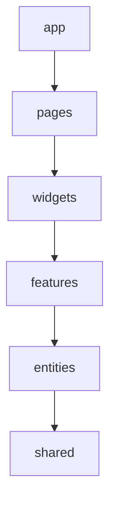
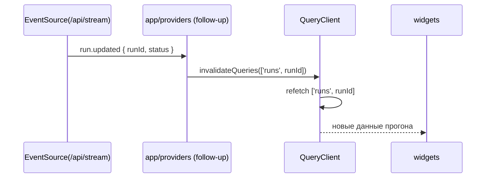
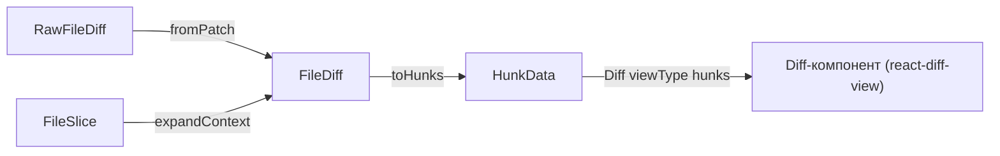

# FRONTEND_ARCHITECTURE — AI Code Reviewer (команда 6)

|                     |                                                                                                                                 |
| ------------------- | ------------------------------------------------------------------------------------------------------------------------------- |
| Статус              | **черновик на утверждение командой**                                                                                            |
| Владелец            | инженер 2, frontend-архитектура (роль 5)                                                                                        |
| Связанные документы | `SYSTEM_DESIGN.md` (роль 1), `BACKEND_ARCHITECTURE.md` / api PR #4 (роль 6, ERD), тулинг PR #26 (роль 4), инфра PR #28 (роль 3) |
| Нумерация решений   | `Ф-1…` (frontend), не пересекается с `Р-n` SD                                                                                   |

**Что это.** Документ фиксирует архитектуру клиента `dmc-268-ui-t6`: слои, состояние, UI-кит,
контракт данных и требования к API, которые frontend выставляет backend'у до того, как тот
готов. Каркас (папки, схемы, адаптеры, два виджета, мок) уже в ветке `17-frontend-architecture`;
документ описывает то, что реализовано, и явно помечает, что осталось открытым.

**Стек.** React 19.3.0, Vite 8.3.0 (rolldown), TypeScript 5.9.3 (TS 7 заблокирован peer-диапазоном
typescript-eslint из PR #26), pnpm 12, antd 6.6.4, react-diff-view 3.3.3, Zod 4.6.5, Zustand 5.0.15,
TanStack Query 5.103.1, Vitest 5.0.1, jsdom 30.1.0, Testing Library 16.3.3. Версии — самые свежие
стабильные на 2026-09-19, выбраны ролью 5 в отсутствие ответа команды (Ф-11).

---

## 0. Решения

| Ф-n  | Решение                                                                                                                  | Причина                                                                                                                            |
| ---- | ------------------------------------------------------------------------------------------------------------------------ | ---------------------------------------------------------------------------------------------------------------------------------- |
| Ф-1  | FSD (lite) вместо Clean Architecture                                                                                     | UI-клиент без доменной логики; FSD — фронтенд-реализация чистой архитектуры (лекция), см. §1.                                      |
| Ф-2  | UI-кит antd 6.6.4                                                                                                        | Tree/Collapse/Descriptions из коробки, peer react ≥ 18, проверено proof-run; подтверждение командой — §3.                          |
| Ф-3  | RunStatus — 7 значений (`completed` вместо `succeeded`, + `publishing/cancelled/skipped`)                                | UI «зависание/retry/отмена»; согласовано с ERD роли 6 и SD §6.4.                                                                   |
| Ф-4  | `RunAction.response \| null` + `responseRef`                                                                             | тела инструментов > 64 КБ выносятся отдельным запросом.                                                                            |
| Ф-5  | Внешний ключ `runId`, тип `RunSession`                                                                                   | одно имя во всём контракте (`ReviewJob`/`Run`/`RunSession` в SD — одна сущность).                                                  |
| Ф-6  | Привязка комментария — пара `oldLine \| null` / `newLine \| null`                                                        | бэкенд мапит `side/line_start`; ключ виджета выводится из пары (§6).                                                               |
| Ф-7  | TanStack Query — серверный кэш; Zustand — UI-состояние, стор живёт в виджете                                             | `shared` не знает о домене; SSE → invalidateQueries (§2).                                                                          |
| Ф-8  | Дифф по проводу — сырой unified diff на файл; парсинг клиентом за адаптером                                              | замена diff-библиотеки = замена одного адаптера (§6).                                                                              |
| Ф-9  | Новый эндпоинт `GET /api/runs/{id}/files?path&offset&limit`                                                              | дочитывание контекста порциями; в SD пути нет (§5, п. 7).                                                                          |
| Ф-10 | JSON на проводе — camelCase                                                                                              | Zod-схемы фронта — источник истины — SD §12 L597; иначе трансформер на каждом ответе.                                              |
| Ф-11 | Самые свежие стабильные версии (React 19.3, Vite 8.3, Vitest 5.0, TS 5.9) — решение роли 5 при отсутствии ответа команды | peer-совместимость проверена по npm registry; TS 7 держит typescript-eslint; расхождения с PR #26/#33 — предложениями в их тредах. |
| Ф-12 | react-router 8 / Mantine 9 только названы, не установлены                                                                | экранов в спринте нет (non-goal); React 19.3 их peer-требования (≥ 19.2) выполняет.                                                |

---

## 1. Слои

Feature-Sliced Design (lite): `app → pages → widgets → features → entities → shared`.



Правила:

- импорты — только вниз по стрелке; наверх и «вбок» — нельзя;
- срезы одного слоя друг друга не импортируют (кроме `shared`, у него срезов нет);
- `shared` никогда не импортирует `entities` (граница из плана, D18: `shared/api/endpoints.ts` —
  только пути/методы, domain-agnostic; привязка «эндпоинт → Zod-схема» — в `entities/*/api`);
- файл компонента экспортирует только компоненты — следствие `react-refresh` (тулинг PR #26):
  вспомогательные функции и типы выносятся в соседние `lib`/`model` файлы.

Область SD §2 → срез FSD (в этом спринте реализованы две из пяти):

| Область SD §2                                    | Срез                                                      |
| ------------------------------------------------ | --------------------------------------------------------- |
| Карточка прогона с диффом и инлайн-комментариями | `entities/diff`, `entities/review`, `widgets/diff-viewer` |
| Инспектор трейса (`RunSession → RunAction`)      | `entities/run`, `widgets/run-inspector`                   |
| Обзор + лента прогонов                           | `pages/runs` (плейсхолдер, `.gitkeep`)                    |
| Репозитории и правила                            | не заведено — вне спринта (non-goal)                      |
| Метрики                                          | не заведено — вне спринта (non-goal)                      |

Дерево `src/` (`find src -type f | sort`):

```
src/App.tsx
src/app/mocks/app-state.test.ts
src/app/mocks/app-state.ts
src/app/providers/QueryProvider.tsx
src/app/providers/UiProvider.tsx
src/app/providers/index.ts
src/app/providers/queryClient.ts
src/entities/diff/api/index.test.ts
src/entities/diff/api/index.ts
src/entities/diff/index.ts
src/entities/diff/lib/commentKey.test.ts
src/entities/diff/lib/commentKey.ts
src/entities/diff/lib/expandContext.test.ts
src/entities/diff/lib/expandContext.ts
src/entities/diff/lib/fromPatch.test.ts
src/entities/diff/lib/fromPatch.ts
src/entities/diff/lib/toHunks.test.ts
src/entities/diff/lib/toHunks.ts
src/entities/diff/model/schemas.test.ts
src/entities/diff/model/schemas.ts
src/entities/review/api/index.ts
src/entities/review/index.ts
src/entities/review/model/schemas.test.ts
src/entities/review/model/schemas.ts
src/entities/run/api/index.test.ts
src/entities/run/api/index.ts
src/entities/run/index.ts
src/entities/run/lib/duoActions.fixture.ts
src/entities/run/lib/groupActions.test.ts
src/entities/run/lib/groupActions.ts
src/entities/run/lib/status.test.ts
src/entities/run/lib/status.ts
src/entities/run/model/schemas.test.ts
src/entities/run/model/schemas.ts
src/features/.gitkeep
src/main.tsx
src/pages/review/.gitkeep
src/pages/runs/.gitkeep
src/shared/api/endpoints.test.ts
src/shared/api/endpoints.ts
src/shared/config/env.test.ts
src/shared/config/env.ts
src/shared/fixtures/sample.patch.ts
src/test/setup.ts
src/vite-env.d.ts
src/widgets/diff-viewer/index.ts
src/widgets/diff-viewer/model/store.ts
src/widgets/diff-viewer/model/types.ts
src/widgets/diff-viewer/ui/DiffViewer.test.tsx
src/widgets/diff-viewer/ui/DiffViewer.tsx
src/widgets/diff-viewer/ui/InlineComment.tsx
src/widgets/diff-viewer/ui/LoadMoreContext.tsx
src/widgets/run-inspector/index.ts
src/widgets/run-inspector/lib/format.ts
src/widgets/run-inspector/model/store.ts
src/widgets/run-inspector/ui/ActionTree.tsx
src/widgets/run-inspector/ui/RunHeader.tsx
src/widgets/run-inspector/ui/RunInspector.test.tsx
src/widgets/run-inspector/ui/RunInspector.tsx
```

**Ф-1.** FSD вместо Clean Architecture. Лектор курса называет FSD «фронтенд-реализацией чистой
архитектуры»: отдельно данные, отдельно сервисы, отдельно интерфейсы
(`base/prerecorded/architecture/zvonok-arkhitektura-servisov-06af8d40.md:71-76`). Это не
альтернатива, а специализация идей Clean Architecture под UI — противопоставление «FSD или Clean»
ложно. Порты/адаптеры Clean Architecture в чистом виде избыточны для UI-клиента без доменной
логики: у нас нет бизнес-правил, которые нужно защищать от фреймворка. Единственный адаптер,
который мы всё же держим осознанно, — граница diff-библиотеки: `fromPatch`/`toHunks` в
`src/entities/diff/lib/` изолируют `react-diff-view` так, что замена библиотеки — это замена
одного адаптера, а не переписывание виджета (`src/widgets/diff-viewer/ui/DiffViewer.tsx` работает
только с типом `FileDiff`, откуда бы он ни пришёл).

---

## 2. Состояние

| Данное                                | Где живёт                                                  | Инвалидация                                   |
| ------------------------------------- | ---------------------------------------------------------- | --------------------------------------------- |
| Список прогонов                       | TanStack Query, ключ `['runs', query]`                     | по времени (`staleTime: 30s`) + `run.updated` |
| Прогон (детали)                       | TanStack Query, ключ `['runs', id]`                        | `run.updated` для этого `runId`               |
| Действия прогона                      | TanStack Query, ключ `['runs', id, 'actions']`             | вместе с прогоном                             |
| Дифф прогона                          | TanStack Query, ключ `['runs', id, 'diff']`                | не меняется после публикации                  |
| Комментарии ревью                     | TanStack Query, ключ `['runs', id, 'comments']`            | вместе с прогоном                             |
| Дочитанные срезы файла                | TanStack Query, ключ `['runs', id, 'files', path, offset]` | не инвалидируется (append-only)               |
| `viewType` (unified/split)            | Zustand, `widgets/diff-viewer/model/store.ts`              | — (UI-состояние, не сервер)                   |
| `selectedFile` (diff-viewer)          | Zustand, `widgets/diff-viewer/model/store.ts`              | —                                             |
| `expandedKeys`, `selectedActionIndex` | Zustand, `widgets/run-inspector/model/store.ts`            | —                                             |
| Черновики комментариев                | —                                                          | future (не реализовано в этом спринте)        |

TanStack Query — не замена Zustand, а дополнение: серверный кэш и клиентский UI-стейт разнесены
по разным сторонам (issue AC явно требует эту формулировку). Стор Zustand живёт в виджете, а не в
`shared` — UI-состояние принадлежит домену виджета, `shared` о нём не знает (план, D17).

SSE-мост (follow-up, **не реализовано**): `app/providers` подписывается на
`EventSource(API_BASE_URL + '/stream')`, на событие `run.updated` вызывает
`queryClient.invalidateQueries({ queryKey: ['runs', runId] })`. Сейчас в `src/app/providers/`
есть только `QueryProvider` (создаёт `QueryClient`, см. `src/app/providers/queryClient.ts`) и
`UiProvider` (antd `ConfigProvider` с русской локалью) — оба без сети.



---

## 3. UI-кит

**Ф-2.** UI-кит — **antd 6.6.4**.

Аргументы: `Tree`/`Collapse`/`Descriptions`/`Tag` закрывают инспектор прогонов без вёрстки с нуля
(см. `RunHeader.tsx`, `ActionTree.tsx`); peer `react ≥ 18` — без бампа React; библиотека
проверена в proof-run под jsdom (`docs/reports/proof-run.md`, (d)); высокая узнаваемость —
ревьюер видит стандартные паттерны, а не самодельные компоненты.

Альтернатива — **Mantine 9.6.1** (peer `react ^19.2` — выполняется после бампа T10): не выбрана,
потому что antd закрывает `Tree`/`Collapse`/`Descriptions` из коробки, а на Mantine эти компоненты
пришлось бы вендорить самостоятельно.

Что теряем, выбирая antd вместо более лёгкой библиотеки:

| Теряем                        | Комментарий                                                                                           |
| ----------------------------- | ----------------------------------------------------------------------------------------------------- |
| Бандл-вес                     | antd крупнее headless-библиотек (Radix/Mantine core); для внутреннего инструмента приемлемо           |
| Свобода кастомизации разметки | компоненты antd навязывают DOM-структуру; кастом — через токены темы, не через переписывание разметки |
| Нейтральность к CSS-парадигме | antd тянет свою систему токенов/`css-in-js`; сосуществование с Tailwind потребует настройки           |

> **Требует решения команды (a).** Подтвердить или оспорить antd 6 как UI-кит. Установка
> обратима: используется в 2 виджетах (`widgets/diff-viewer`, `widgets/run-inspector`) и одном
> провайдере (`UiProvider`); откат — удалить зависимости `antd`/`@ant-design/icons` и переписать
> `Descriptions`/`Tree`/`Collapse`/`Tag`/`Segmented` на замену.

> **Требует решения команды (b).** Стилевая парадигма — не решена ролью 5 единолично (issue DoR:
> «UI-кит — единственный пункт, отданный этой роли на решение»). Варианты:
>
> - **CSS Modules** — плюсы: изоляция без рантайм-накладных, знакомо всей команде, не зависит от
>   UI-кита; минусы: два источника стилей (модули + antd-токены), нет доступа к theme-переменным
>   antd напрямую; риск: дублирование отступов/цветов вручную.
> - **antd tokens / css-in-js (`ConfigProvider` + `useToken`)** — плюсы: один источник правды по
>   цветам/отступам, тема меняется в одном месте; минусы: связывает вёрстку с antd (миграция с
>   UI-кита дороже), css-in-js добавляет рантайм-стоимость; риск: неявная связность компонентов с
>   темой.
> - **Tailwind** — плюсы: скорость вёрстки, консистентность утилитами; минусы: конфликт директив
>   с ESLint/Prettier конфигом PR #26 не проверен (роль 4 на момент DoR ещё не занята); риск:
>   двойная система стилизации поверх antd-классов.
>
> Без решения команды по умолчанию — **antd tokens для темизации + CSS Modules для вёрстки
> layout**-контейнеров (список/сетка/шапка), без рекомендации сверх этого дефолта.

---

## 4. Контракт данных

Источник истины — Zod-схемы в `src/entities/{run,diff,review}/model/schemas.ts`. Ниже — состав
полей (не полный код); объекты не strict — `z.object` в Zod 4 по умолчанию отбрасывает неизвестные
ключи, а не падает на них.

```ts
// entities/run — RunStatus: 7 значений, RunSession, RunAction, RunListPage
RunStatusSchema = enum(queued|running|publishing|completed|failed|cancelled|skipped)
RunSession = { id, engine: fast|deep, model, status, startedAt, finishedAt,
  attempt, cancelRequested, pullRequest: PullRequestRef, actionCount, errorCode }
RunAction = { id, runId, index, tool, request: unknown, response: unknown|null,
  responseRef, startedAt, durationMs }
RunListPage = { items: RunSession[], nextCursor }

// entities/diff — DiffLine, Chunk, FileDiff, RawFileDiff (wire), FileSlice
DiffLine = { type: context|added|removed, oldLine, newLine, content }
FileDiff = { filename, chunks: Chunk[] }        // клиентская модель, единственный вход DiffViewer
RawFileDiff = { filename, patch }               // провод: GET /api/runs/{id}/diff

// entities/review
ReviewComment = { id, file, oldLine, newLine, endLine, body, ruleName,
  severity: critical|high|medium|low|info, category: security|correctness|performance|readability,
  title, createdAt }
```

Инварианты (проверены тестами схем):

- `DiffLine`: `context` ⇒ `oldLine` и `newLine` оба не `null`; `added` ⇒ `oldLine = null`,
  `newLine` не `null`; `removed` ⇒ `newLine = null`, `oldLine` не `null`;
- `ReviewComment`: хотя бы одна из `oldLine`/`newLine` не `null`;
- `RunSession`: `finishedAt ≠ null` ⇒ `status` — терминальный (`completed|failed|cancelled|skipped`).

Отклонения от схем issue:

| Поле issue                       | Стало                                                       | Причина                                                                                 |
| -------------------------------- | ----------------------------------------------------------- | --------------------------------------------------------------------------------------- |
| `RunSession.status` — 4 значения | 7 значений                                                  | статусы `publishing`/`cancelled`/`skipped` нужны UI; согласовано с ERD роли 6 и SD §6.4 |
| `RunSession.agent`               | `engine: 'fast'\|'deep'`                                    | ERD роли 6 называет поле `Engine`; «agent» — термин из Duo, не наш домен                |
| `RunSession.jobId`               | удалено                                                     | в системе job = run, поле дублировало бы `id`                                           |
| `RunSession` +                   | `attempt`, `cancelRequested`, `errorCode`                   | статусы «зависание/retry/отмена» из issue §6 не выразить без этих полей                 |
| `RunAction.sessionId`            | `runId`                                                     | единое имя внешнего ключа во всём контракте                                             |
| `RunAction.response`             | `response \| null` + `responseRef`                          | тела ответов инструментов > 64 КБ выносятся отдельным запросом                          |
| `ReviewComment` +                | `endLine`, `severity`, `category`, `title`                  | поля есть в ERD роли 6 (`Finding`); UI показывает severity в списке                     |
| — (новые типы)                   | `RawFileDiff`, `FileSlice`, `RunListPage`, `PullRequestRef` | провод диффа, пагинация списка, дочитывание контекста                                   |

---

## 5. Требования к API

Ниже — 10 пунктов, которые фронт выставляет backend'у. Текст ниже предназначен для публикации
комментарием в PR #30 (`https://github.com/larchanka-training/dmc-268-ui-t6/pull/30`) и в api PR
#4 (`https://github.com/larchanka-training/dmc-268-api-t6/pull/4`) — на момент написания документа
комментарии ещё **не отправлены**, требуется отдельное решение о публикации.

1. JSON на проводе — camelCase; Zod-схемы фронта источник истины (SD §12, L597). — роль 6.
2. `GET /api/runs?status&repo&cursor` возвращает `RunListPage` (конверт с `nextCursor`), а не голый
   массив — поправка к SD §12 (L602 сейчас указывает `RunSession[]`). — роль 1.
3. `GET /api/runs/{id}` возвращает `RunSession`, собранный из ERD роли 6: `id/status/engine/
attempt/cancelRequested/startedAt/finishedAt/errorCode` из `runs`, `model` из последнего
   `UsageEvent.model`, `actionCount` из `count(run_actions)`, `pullRequest` из `code_changes`. —
   роль 6.
4. `GET /api/runs/{id}/diff` возвращает `RawFileDiff[]`; `patch` — вывод `git diff` на файл,
   обязан начинаться со строки `diff --git a/<path> b/<path>` и содержать `---`/`+++` — без них
   `gitdiff-parser` не привязывает hunks к файлу (подтверждено чтением исходника и proof-run,
   `docs/reports/proof-run.md`, (a)). — роль 6.
5. `GET /api/runs/{id}/comments` возвращает `ReviewComment[]`; `side/line_start` → `oldLine/
newLine` (`RIGHT→newLine`, `LEFT→oldLine`), `line_end → endLine`. — роль 6.
6. `GET /api/runs/{id}/actions` возвращает `RunAction[]`; `response` инлайн ≤ 64 КБ, иначе —
   `responseRef` и отдельный `GET /api/runs/{id}/actions/{index}/response`. — роль 6.
7. Новый эндпоинт `GET /api/runs/{id}/files?path&offset&limit` → `FileSlice` для дочитывания
   контекста; для прогонов старше TTL blob-кэша — `404`/`410`, UI покажет «контекст недоступен». —
   роль 6.
8. Статусы в DTO: `succeeded → completed`; `publishing` добавить в SD §12; `POST /cancel` отдаёт
   `RunSession` со `status: cancelled` или `cancelRequested: true`. — роль 1 и роль 6.
9. `GET /api/stream` (SSE `run.updated`) — payload минимум `{ runId, status }`. — роль 6.
10. Неточности SD, которые нужно поправить или подтвердить: §2 (L39) «фронт не парсит дифф» — фронт
    парсит библиотекой (`react-diff-view`) за адаптером, а не вручную; терминология `ReviewJob`
    (§11) / `Run` (ERD роли 6) / `RunSession` (§2, §12) — зафиксировать как одну и ту же сущность;
    §14 (caddy) расходится с PR #28 (nginx) — уточнить прод-раздачу. — роль 1.

Координация с ролями 3 и 4 (не входит в 10 пунктов выше, отдельные заметки):

- роль 4 (PR #26): `src/vite-env.d.ts` уже в репозитории; `@types/node` в `tsconfig.node.json`
  понадобится для чтения `PORT` из `process.env` в `vite.config.ts` — после мержа #26;
- роль 3 (PR #28): `docker/nginx.conf` сейчас не проксирует `/api/` и `/api/stream`; при
  `VITE_API_BASE_URL=/api` (same-origin) нужен `location /api/ { proxy_pass …; proxy_buffering
off; }` для SSE, либо в документе фиксируется cross-origin вариант с CORS на бэкенде — решить с
  ролями 3 и 6.

---

## 6. Просмотрщик диффа

Компоненты (`src/widgets/diff-viewer/`):

| Компонент         | Файл                     | Props                                                                                                          |
| ----------------- | ------------------------ | -------------------------------------------------------------------------------------------------------------- |
| `DiffViewer`      | `ui/DiffViewer.tsx`      | `file: FileDiff`, `comments: ReviewComment[]`, `totalLines?: number`, `onLoadMore?: (gap: ContextGap) => void` |
| `InlineComment`   | `ui/InlineComment.tsx`   | комментарий, привязанный к строке диффа (виджет `react-diff-view`)                                             |
| `LoadMoreContext` | `ui/LoadMoreContext.tsx` | кнопка дочитывания контекста в зазоре между хунками                                                            |

Поток данных:



`fromPatch` (`src/entities/diff/lib/fromPatch.ts`) прогоняет `patch` через `parseDiff`, берёт
`filename` из `RawFileDiff.filename` (не из распарсенного `newPath` — proof-run показал, что без
`diff --git`-заголовка `newPath` пустой), и валидирует результат `FileDiffSchema`. `toHunks`
(`src/entities/diff/lib/toHunks.ts`) — обратное преобразование, нужное `<Diff>` для рендера и
`expandContext` для дозагрузки. `expandContext` (`src/entities/diff/lib/expandContext.ts`)
строит хунк из `FileSlice.lines` через `textLinesToHunk`, вычисляет `oldStart` смещением от
ближайшего предыдущего хунка и сливает его в существующие через `insertHunk`.

Ключ привязки комментария — `commentKey` (`src/entities/diff/lib/commentKey.ts`), реализует
правило N/I/D:

| Тип строки диффа           | Ключ         |
| -------------------------- | ------------ |
| `context` (есть `oldLine`) | `N<oldLine>` |
| `added` (есть `newLine`)   | `I<newLine>` |
| `removed` (есть `oldLine`) | `D<oldLine>` |

Для `ReviewComment` с `newLine ≠ null` ключ ищется по строке с этим `newLine`: если она `added` —
`I<newLine>`, если `context` — `N<oldLine>` той же строки. Для `oldLine ≠ null` без `newLine` —
поиск по `removed`/`context` аналогично. Если строка не найдена в текущем `FileDiff` (комментарий
вне видимого диффа) — `commentKey` возвращает `null`, виджет для него не рисуется.

«Дочитать контекст» — зазор вычисляется в `DiffViewer.tsx` (`gapBeforeHunk`/`gapAfterLastHunk`):
для каждой пары соседних хунков зазор — это `{ startLine: prev.newStart + prev.newLines, count:
next.newStart - startLine }`; хвостовой зазор после последнего хунка — до `totalLines` файла
(параметр компонента). Зазор с `count ≤ 0` не показывается.

Почему обязателен заголовок `diff --git` — proof-run (a): `gitdiff-parser@0.3.1` открывает новый
файл только по строке `diff --git a/<path> b/<path>`; без неё хунки не привязываются к имени
файла (см. §5, пункт 4).

---

## 7. Инспектор прогонов

`RunHeader` (`src/widgets/run-inspector/ui/RunHeader.tsx`) — поля шапки: движок, модель, статус
(`Tag` + предупреждение о «зависании»), время запуска, длительность, PR (ссылка), попытка, число
действий, код ошибки.

`ActionTree` (`src/widgets/run-inspector/ui/ActionTree.tsx`) — дерево действий поверх antd `Tree`.
Ключи узлов: группа — `group-<firstIndex>` (индекс первого действия в группе), одиночное действие
и лист группы — `action-<index>`.

Группировка — `groupActions` (`src/entities/run/lib/groupActions.ts`): подряд идущие действия с
одним `tool` схлопываются в узел `{ kind: 'group', tool, count, actions }`, если длина серии
`≥ 3` (`MIN_GROUP_SIZE`); короче — каждое действие остаётся отдельным узлом `{ kind: 'action' }`.

7 статусов и их разбиение (`src/entities/run/model/schemas.ts`, `src/entities/run/lib/status.ts`):

| Группа                      | Статусы                                       |
| --------------------------- | --------------------------------------------- |
| Активные (`isActive`)       | `queued`, `running`, `publishing`             |
| Терминальные (`isTerminal`) | `completed`, `failed`, `cancelled`, `skipped` |

Цвета `Tag` (`statusColor`): `queued → default`, `running → processing`, `publishing → blue`,
`completed → success`, `failed → error`, `cancelled → warning`, `skipped → default`.

«Зависший» `running` — `isStaleRunning`: `status === 'running'`, `finishedAt === null`,
`startedAt` старше 10 минут (`STALE_RUNNING_MS`) — порог совпадает с порогом реконсилера в SD §6.4
(`queued` старше 10 мин без сообщения → повтор публикации).

Хуки под cancel/retry в контракте уже есть, UI для них — вне спринта: `cancelRequested: boolean`
(флаг отмены до подтверждения бэкендом) и `attempt: number` (номер попытки при retry) на
`RunSession`.

---

## 8. Мок

Файл: `src/app/mocks/app-state.ts`. Содержит:

- `mockRunSessions` — 7 сессий, по одной на каждый статус (включая «зависший» `running`);
- `mockFileDiffs` — 2 диффа, полученных прогоном фикстур-патчей через `fromPatch`;
- `mockReviewComments` — 3 комментария (два — с `ruleName`, один — без);
- `mockRunActions` — 34 действия в Duo-подобной последовательности (`makeDuoActions`,
  `src/entities/run/lib/duoActions.fixture.ts`: `get_pull_request`, `get_diff`, 19× `get_tree`,
  11× `get_blob`, `get_pull_request`, `post_review`), 2 действия с `responseRef` вместо `response`;
- `mockUiState` — состояние виджетов (выбранный прогон/файл, раскрытые узлы дерева).

Фрагмент одного `RunSession`:

```json
{
  "id": "11111111-1111-4111-8111-000000000004",
  "engine": "deep",
  "status": "completed",
  "startedAt": "2026-09-18T11:50:00.000Z",
  "finishedAt": "2026-09-18T11:55:12.000Z",
  "attempt": 1,
  "cancelRequested": false,
  "actionCount": 34,
  "errorCode": null
}
```

Валидация — тестом: `src/app/mocks/app-state.test.ts` прогоняет весь мок через Zod-схемы
(`RunSessionSchema`, `FileDiffSchema`, `ReviewCommentSchema`, `RunActionSchema`) и проверяет, что
`parse` не бросает исключение.

---

## 9. Логирование / конфиг / роутер

**Логирование.** Библиотека — **pino** (browser mode). Названа как решение, **не установлена** —
issue прямо выносит подключение логирования за рамки спринта (non-goal).

**Конфигурация.** `VITE_API_BASE_URL` (`src/shared/config/env.ts`, Zod-схема `EnvSchema`, default
`/api`) — same-origin по умолчанию, требует на проде `location /api/` в nginx (координация с
ролью 3, см. §5). `PORT` для dev/preview — **зафиксированное в этом документе требование**, не
код: чтение `process.env.PORT` в `vite.config.ts` нуждается в `@types/node` в
`tsconfig.node.json`, который меняет роль 4 (PR #26) — follow-up после его мержа (§11). Прод-порт
— зона ответственности инфры (роль 3, PR #28, сейчас `:8080` захардкожен).

**Роутер.** Назван **react-router 8** (8.4.0, peer react ≥ 19.2.7 — выполняется), не установлен —
экранов в спринте нет.

---

## 10. Тесты и гейты

Что покрыто тестами:

- схемы (`*.model.schemas.test.ts`) — фикстуры на принятие и отклонение по каждому инварианту §4;
- адаптеры диффа — round-trip `fromPatch`/`toHunks` (`fromPatch.test.ts`, `toHunks.test.ts`),
  `commentKey.test.ts`, `expandContext.test.ts`;
- `groupActions` на 34-действенной Duo-фикстуре — ожидание 6 узлов (2 группы: `get_tree`×19,
  `get_blob`×11 + 4 одиночных: `get_pull_request`×2, `get_diff`, `post_review`);
- `src/app/mocks/app-state.test.ts` — валидация всего мока схемами;
- 2 smoke-теста под jsdom: `DiffViewer.test.tsx`, `RunInspector.test.tsx`.

Команды: `pnpm test` (запускает `vitest run`, работает уже сейчас). Итого 83 теста в 16 файлах
(`pnpm test`, 2026-09-18). После мержа PR #26 добавляются `pnpm lint`, `pnpm check-types`,
`pnpm build` — они настраиваются ролью 4, в этой ветке не выполняются.

Vitest настроен без `globals`, поэтому RTL не чистит DOM сама — в jsdom-тестах (`DiffViewer.test.tsx`,
`RunInspector.test.tsx`) `afterEach(cleanup)` вызывается явно.

jsdom-стабы (`src/test/setup.ts`, подключён через `test.setupFiles` в `vite.config.ts`,
`docs/reports/proof-run.md`, (d)): `window.matchMedia` (нужен `Descriptions`/`useBreakpoint`
antd) и `ResizeObserver` (нужен `Tree` через `@rc-component/virtual-list`) — jsdom 30.1.0 их не
предоставляет.

---

## 11. Открытые вопросы / follow-ups

- **TypeScript 7** — когда typescript-eslint снимет peer `<6.1.0` (роль 4).
- **После мержа #26** — rebase, единый набор пинов (предложение в #26).
- **`steiger`** — FSD-линтер, форматирует нарушения правил §1 автоматически; не подключён.
- **`PORT` в `vite.config.ts`** — код после мержа PR #26 и добавления `@types/node` в
  `tsconfig.node.json` (роль 4).
- **SSE-мост** (§2) — `EventSource`-подписка и `invalidateQueries` не реализованы, только
  спроектированы.
- **Fetch-клиент и авторизация** — JWT/OAuth (SD §12: `POST /auth/github/callback` → JWT,
  `Authorization: Bearer` на всех `/api/*`) — в этом документе описаны как слой, который появится
  над `entities/*/api`, код не написан.
- **Экраны 3–5** (репозитории, правила, метрики) — области SD §2, не реализованные в этом
  спринте; `src/pages/` содержит только плейсхолдеры для двух реализованных областей.
- **`POST /api/runs/{id}/rerun`** — есть в SD §12, отсутствует в `src/shared/api/endpoints.ts`
  (`endpoints.runs` содержит только `cancel`) — добавить эндпоинт в контракт до реализации UI
  повторного запуска.
- **Ребейз после мержа #26** — тулинг (ESLint/Prettier/Stylelint/Husky/pnpm-lock) изменит файлы
  конфигурации; после мержа — ребейз ветки и регенерация lockfile.

---

## 12. Покрытие issue #17

| Пункт AC/DoD issue #17                                                                  | Где в этом документе / коде                                                  |
| --------------------------------------------------------------------------------------- | ---------------------------------------------------------------------------- |
| `FRONTEND_ARCHITECTURE.md` подан пул-реквестом                                          | этот файл, ветка `17-frontend-architecture`                                  |
| Структура слоёв обоснована, есть схема и правила зависимостей                           | §1                                                                           |
| Разделение состояния: Zustand vs серверный кэш, TanStack Query — дополнение, не замена  | §2                                                                           |
| UI-кит назван и обоснован, альтернатива рассмотрена, выбор — на команду                 | §3, оба callout'а «Требует решения команды»                                  |
| Zod-схемы `DiffLine`, `FileDiff`, `ReviewComment`, `RunSession`, `RunAction` выписаны   | §4; код — `src/entities/{diff,review,run}/model/schemas.ts`                  |
| Отдельный раздел с требованием к API, передан ролям 6 и 1                               | §5 (публикация комментариев — открыта, см. §5)                               |
| Компоненты просмотрщика диффа: подсветка, инлайн-комментарий, дозагрузка контекста      | §6; код — `src/widgets/diff-viewer/`                                         |
| Инспектор прогонов: шапка, дерево, схлопывание, статусы queued/running/completed/failed | §7; код — `src/widgets/run-inspector/` (статусов фактически 7, см. §4 и Ф-3) |
| Мок состояния приложения с заполненными данными                                         | §8; код — `src/app/mocks/app-state.ts`                                       |
| Базовые компоненты для кодовых блоков и диффов (или структура папок)                    | §6, §1 (дерево `src/widgets/diff-viewer/`)                                   |
| Логирование фронтенда названо, конфигурация через env зафиксирована                     | §9                                                                           |
| Пул-реквест отревьюен минимум одним участником команды                                  | вне PR — организационный шаг                                                 |
| `FRONTEND_ARCHITECTURE.md` смержен в `main`                                             | вне PR — организационный шаг                                                 |
| Базовые компоненты/структура папок для диффов в репозитории                             | код на ветке, см. §1                                                         |
| Мок состояния в репозитории                                                             | `src/app/mocks/app-state.ts`                                                 |
| ПР отревьюен, замечания учтены/отклонены в треде                                        | вне PR                                                                       |
| Требование к API диффа передано ролям 6 и 1 письменно                                   | §5 — текст готов, публикация не решена                                       |
| Линтеры и сборка проходят на ветке (в объёме, настроенном ролью 4)                      | вне PR — зависит от мержа PR #26                                             |
| Статус задачи в Projects #12 обновлён                                                   | вне PR                                                                       |
| Решения, требующие консенсуса (UI-кит, стилевая парадигма), вынесены на команду         | §3, оба callout'а «Требует решения команды»                                  |
