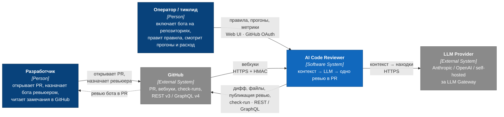
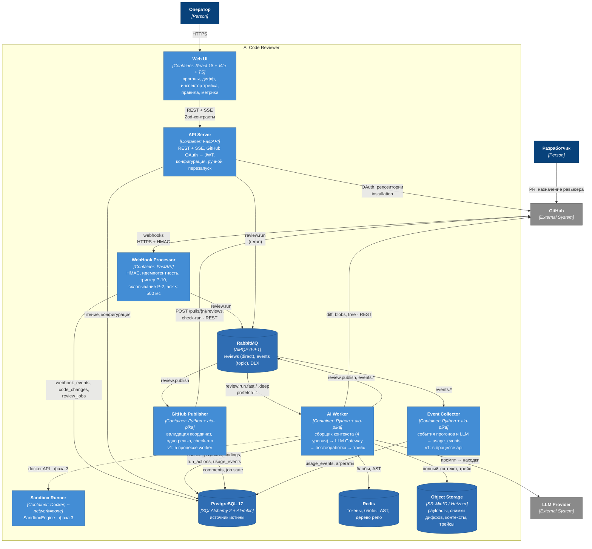
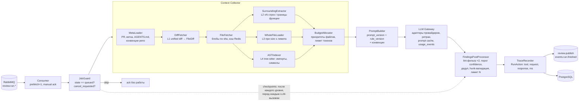
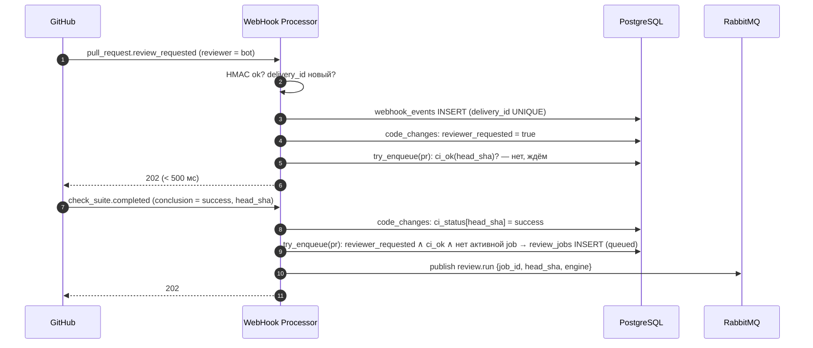
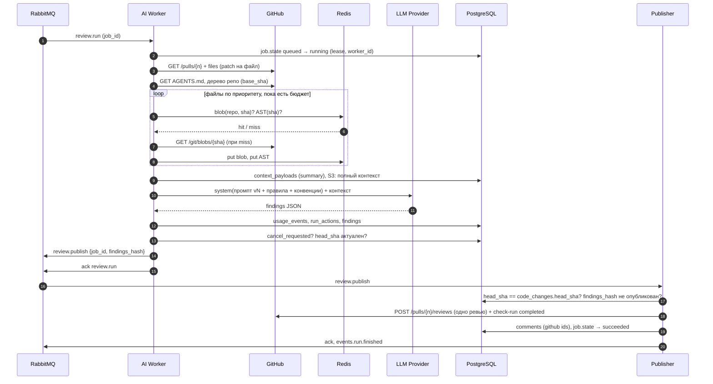
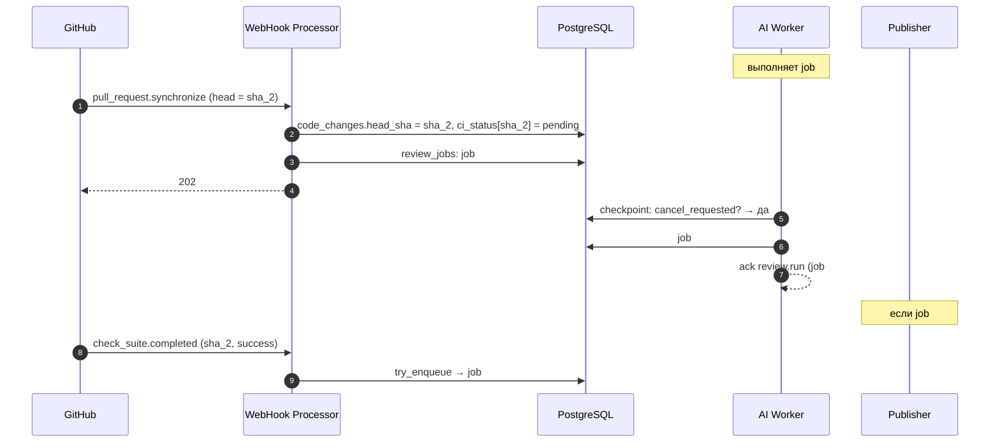
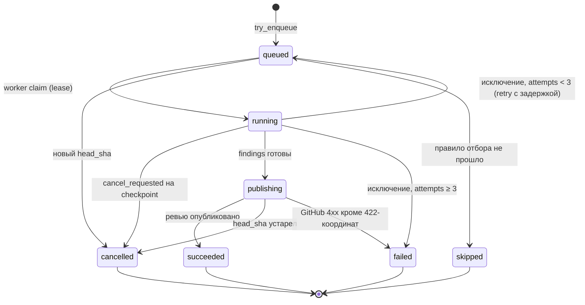
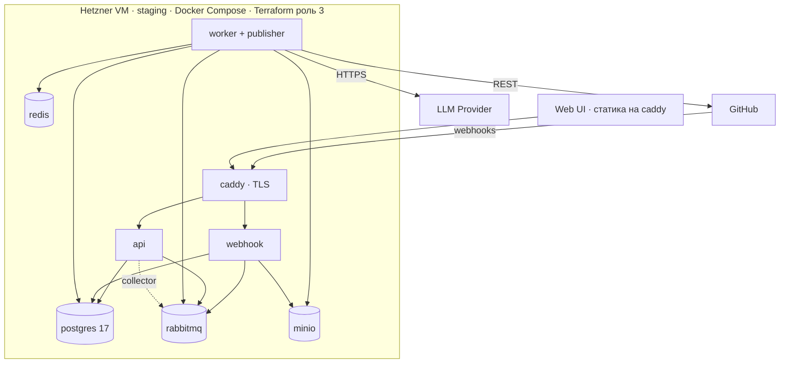

# SYSTEM_DESIGN — AI Code Reviewer (команда 6)

| | |
|---|---|
| Статус | **черновик на утверждение командой** |
| Владелец | техлид (роль 1) |
| Связанные документы | `BACKEND_ARCHITECTURE.md` (роль 6, ERD), `FRONTEND_ARCHITECTURE.md` (роль 5, Zod-контракты), `TEST_PLAN.md` (роль 2, quality gates), инфраструктура (роль 3) |
| Нумерация решений | `Р-1…Р-9` — общая с `TEST_PLAN.md`, не менять |

**Продукт.** GitHub App, которого назначают ревьюером в pull request. После зелёного CI бот публикует одно ревью с inline-комментариями прямо в PR. Web UI показывает прогоны, трейс действий агента, метрики и расход.

**Стек (зафиксирован).** Backend: Python 3.13, FastAPI, SQLAlchemy 2, Alembic, PostgreSQL 17, RabbitMQ, Redis, uv, ruff, mypy strict. Frontend: React 18, Vite, TypeScript, pnpm, Zustand + TanStack Query, Zod, Vitest. Инфра: Hetzner Cloud, Terraform, Docker Compose.

---

## 1. Решения

| # | Решение | Причина |
|---|---|---|
| Р-1 | Транспорт задач — **RabbitMQ** (durable, persistent, ack после фиксации состояния). **Источник истины — PostgreSQL**: брокер доставляет указатель на задачу, состояние живёт в БД | Микросервисы → общая БД как очередь становится антипаттерном; RabbitMQ даёт ack/DLQ/приоритеты; отмена и схлопывание не выражаются в брокере — поэтому состояние в БД |
| Р-2 | Один активный прогон на PR: ключ `(installation_id, repo_id, pr_number)`; новый пуш отменяет предыдущий прогон, побеждает последний `head_sha` | Иначе 10 пушей = 10 ревью и 10× цена. Разные PR, ветки, репозитории — параллельны |
| Р-3 | Два движка за одним контрактом `Finding[]`: **DiffEngine** (без диска, ≤ 40 с) и **SandboxEngine** (контейнер, ≤ 10 мин). v1 = DiffEngine | Движок будет меняться; всё ниже контракта об этом не знает |
| Р-4 | Сандбокс: `--network=none`, без токенов внутри, клон монтирует контроллер снаружи | Промпт-инъекция в диффе — штатная ситуация |
| Р-5 | Публикация **одним** `POST /pulls/{n}/reviews`; повтор безопасен по `findings_hash`; строки вне диффа — в тело ревью | N комментариев = N уведомлений и N вызовов к rate limit; 422 от GitHub на строку вне диффа |
| Р-6 | Правила и промпты — неизменяемые версии; прогон ссылается на `rule_version_id`, `prompt_version_id` | Dry-run, откат, объяснимость — бесплатно |
| Р-7 | Арендатор = **Workspace** (роль 6), к которому привязана `ProviderInstallation`; права на репозитории — из провайдера, не из своей таблицы ролей | Своя модель ролей разъедется с GitHub |
| Р-8 | `usage_events` (токены, деньги, модель) — с первого вызова LLM, только вставка | Восстановить задним числом нельзя; основа для `CreditLedger` |
| Р-9 | Бот односторонний: публикует, на комментарии не отвечает; **обязательно** игнорирует собственные события | Скорость запуска; защита от цикла «бот → CI → бот» |
| Р-10 | Триггер — **конъюнкция двух событий в любом порядке**: бот назначен ревьюером ∧ CI успешен для текущего `head_sha` | Решение мита; события независимы, порядок не гарантирован |
| Р-11 | Провайдер VCS — за портом `VcsProvider`; v1 реализует только GitHub | ТЗ упоминает GitLab, роль 6 — Bitbucket; порт дешёвый, реализации — нет |
| Р-12 | Один образ, пять точек входа (`api`, `webhook`, `worker`, `publisher`, `collector`); на старте `publisher` живёт в процессе `worker`, `collector` — в процессе `api` | Микросервисы без пяти репозиториев; разнести = поменять compose, а не код |

---

## 2. Границы ответственности

| Слой | Отвечает | Не отвечает |
|---|---|---|
| **Frontend** (`dmc-268-ui-t6`) | Экраны: обзор + лента прогонов, карточка прогона с диффом и инлайн-комментариями, инспектор трейса (`RunSession → RunAction`), репозитории и правила, метрики. Клиентское состояние (Zustand), серверный кэш (TanStack Query) | Не считает метрики, не парсит дифф (получает готовые `FileDiff` или сырой unified-diff), не знает про провайдеров |
| **Backend** (`dmc-268-api-t6`) | Приём вебхуков, триггер, очередь, состояние прогонов, сборка контекста, вызов LLM, постобработка находок, публикация, метрики, авторизация, кэш | Не хранит код клиентов дольше прогона; не принимает решений о качестве кода — это LLM |
| **LLM-сервисы** | Анализ контекста → находки в фиксированной схеме; промежуточный шаг «конвенции репозитория» (роль 7) | Не ходят в GitHub, не имеют токенов, не решают, что публиковать (фильтрует постобработка) |

---

## 3. C4 — уровень 1: контекст

> Нотация C4, рендер через `flowchart`: родной `C4Context`/`C4Container` в Mermaid накладывает подписи рёбер друг на друга.



---

## 4. C4 — уровень 2: контейнеры



**Один образ, пять entrypoint'ов** (Р-12): `uv run python -m app.api | app.webhook | app.worker | app.publisher | app.collector`. Staging (Hetzner, одна VM, compose): `api`, `webhook`, `worker` (внутри — publisher), `postgres`, `rabbitmq`, `redis`, `minio`, `caddy` (TLS). Роль 3 разводит по сервисам — код не меняется.

---

## 5. C4 — уровень 3: компоненты AI Worker



Контракт между движками и всем остальным:

```python
@dataclass(frozen=True)
class Finding:
    path: str
    line: int                 # строка в новой версии файла (side=RIGHT)
    start_line: int | None    # для многострочных
    severity: Literal["critical", "high", "medium", "low", "info"]
    category: Literal["security", "correctness", "performance", "readability"]
    title: str
    body: str                 # markdown, ≤ 1200 символов
    suggestion: str | None    # готовая замена строк → ```suggestion
    confidence: float         # 0..1
    rule_name: str | None     # имя пользовательского правила → префикс атрибуции (роль 7)
    commit_sha: str           # head_sha, на который ревьюили
```

---

## 6. Потоки данных

### 6.1 Триггер (Р-10): два события в любом порядке



`try_enqueue` — одна функция, вызывается из обоих обработчиков; условие проверяется по состоянию в БД, а не по тому, какое событие пришло последним. Если у репозитория нет CI (`wait_for_ci = auto` и ни одного check suite для `head_sha` за 2 минуты) — прогон стартует по одному назначению.

### 6.2 Прогон: быстрый путь



### 6.3 Схлопывание (Р-2): пуш во время прогона



Сообщение job#1 в RabbitMQ удалить нельзя — поэтому решение всегда принимается по состоянию в БД (`JobGuard`), а брокер только доставляет.

### 6.4 Состояния ReviewJob



Реконсилер (в `api`, раз в 5 мин, лидер через `pg_advisory_lock`): `running` с истёкшим `lease_until` → `queued` + повторная публикация сообщения; `queued` старше 10 мин без сообщения → повторная публикация.

---

## 7. Очередь: RabbitMQ

### 7.1 Топология

| Exchange | Тип | Routing key | Очередь | Потребитель | Свойства |
|---|---|---|---|---|---|
| `reviews` | direct | `review.run.fast` | `review.run.fast` | AI Worker (fast pool) | durable, `x-max-priority=10`, DLX → `reviews.dlx` |
| `reviews` | direct | `review.run.deep` | `review.run.deep` | AI Worker (deep pool) | то же; отдельный пул — чтобы сандбокс не блокировал быстрые |
| `reviews` | direct | `review.publish` | `review.publish` | GitHub Publisher | durable, DLX |
| `reviews.retry` | direct | `retry.30s` / `retry.2m` / `retry.10m` | `retry.*` | — | `x-message-ttl`, `x-dead-letter-exchange=reviews` (отложенный повтор без плагина) |
| `reviews.dlx` | fanout | — | `reviews.dlq` | оператор / реконсилер | хранение 7 дней |
| `events` | topic | `run.*`, `llm.*`, `feedback.*` | `events.collector` | Event Collector | durable; потеря допустима, но нежелательна |

Параметры: сообщения `delivery_mode=2`, publisher confirms включены, `prefetch_count=1` на run-очередях (задачи длинные и неравные), ack **только после** фиксации состояния в PostgreSQL, `consumer_timeout=45min` (глубокий путь ≤ 10 мин с запасом).

### 7.2 Форматы сообщений

Сообщение — **указатель**, не данные: без диффов, без payload'ов. Всё, что нужно воркеру, он читает из БД и GitHub по идентификаторам. Так сообщение остаётся < 1 КБ, а состояние — единым.

```jsonc
// review.run/v1  — WebHook Processor | API → AI Worker
{
  "schema": "review.run/v1",
  "message_id": "b3c1…",            // = job_id; ключ идемпотентности
  "job_id": "b3c1…",
  "workspace_id": "ws_…",
  "installation_id": 12345678,
  "repo": { "id": "r_…", "provider": "github", "external_id": 987, "full_name": "org/repo" },
  "pr":   { "number": 42, "head_sha": "a3f9…", "base_sha": "0c2e…", "base_ref": "main" },
  "engine": "fast",                 // fast | deep
  "rule_version_id": "rv_7",
  "prompt_version_id": "pv_12",
  "trigger": "webhook",             // webhook | manual | rerun | dry_run
  "attempt": 1,
  "requested_at": "2026-09-13T10:00:00Z"
}
```

```jsonc
// review.publish/v1 — AI Worker → GitHub Publisher
{
  "schema": "review.publish/v1",
  "message_id": "pub_b3c1…",
  "job_id": "b3c1…",
  "run_id": "run_…",
  "head_sha": "a3f9…",
  "findings_hash": "sha256:…",      // hash отсортированных находок → идемпотентность Р-5
  "review_event": "COMMENT"         // COMMENT | REQUEST_CHANGES — из правил репозитория
}
```

```jsonc
// events/v1 — любой контейнер → Event Collector (topic events)
{
  "schema": "events/v1",
  "type": "run.finished",           // run.started | run.finished | run.cancelled | llm.call | review.published | feedback.signal
  "occurred_at": "…",
  "workspace_id": "ws_…",
  "job_id": "b3c1…",
  "payload": { "engine": "fast", "duration_ms": 31200, "findings": 6, "published": 5 }
}
```

Правила: заголовок `schema` версионируется, потребитель отвергает незнакомую мажорную версию в DLQ; `message_id` = детерминированный id из БД, повторная доставка безопасна; `x-death` считает попытки, после 3 — `reviews.dlq` и `job.state = failed` с причиной.

---

## 8. Взаимодействие с VCS

### 8.1 Порт `VcsProvider` (Р-11)

```python
class VcsProvider(Protocol):
    def verify_webhook(self, headers: Mapping[str, str], body: bytes) -> WebhookEvent: ...
    async def get_pull_request(self, repo: RepoRef, number: int) -> PullRequest: ...
    async def get_diff(self, repo: RepoRef, number: int) -> list[RawFilePatch]: ...   # unified diff на файл
    async def get_blob(self, repo: RepoRef, blob_sha: str) -> bytes: ...
    async def get_tree(self, repo: RepoRef, ref: str) -> list[TreeEntry]: ...
    async def get_ci_status(self, repo: RepoRef, sha: str) -> CiStatus: ...
    async def upsert_check_run(self, repo: RepoRef, sha: str, status: CheckRun) -> str: ...
    async def post_review(self, repo: RepoRef, number: int, review: ReviewPayload) -> str: ...
    async def list_feedback(self, repo: RepoRef, number: int) -> list[FeedbackSignal]: ...
```

v1 — `GitHubProvider`. `GitLabProvider` (MR `changes`, `discussions`, `pipeline` events, bot-user token) и `BitbucketProvider` — по портy, без реализации.

### 8.2 GitHub: события и права

| Событие | Действия | Что делаем |
|---|---|---|
| `pull_request` | `opened`, `reopened`, `synchronize`, `edited` | upsert `code_changes`; `synchronize` → сброс `ci_status`, `cancel_requested` активной job |
| `pull_request` | `review_requested` / `review_request_removed` | `reviewer_requested = true/false` (только если reviewer — наш бот) |
| `pull_request` | `closed` | отмена активной job |
| `check_suite`, `workflow_run` | `completed` | `ci_status[head_sha]`; success = все suites для sha успешны |
| `status` | — | для репозиториев со сторонним CI через commit status |
| `pull_request_review_thread` | `resolved`, `unresolved` | `feedback_signals` |
| `installation`, `installation_repositories` | `created`, `deleted`, `added`, `removed` | синхронизация `repositories` |

Права App: `pull_requests: write`, `checks: write`, `contents: read`, `metadata: read`. Бот **не** имеет `contents: write`.

### 8.3 Правила работы с API

| Правило | Как |
|---|---|
| Ответ на вебхук < 500 мс | Проверка HMAC (`X-Hub-Signature-256`, `hmac.compare_digest`), INSERT, publish — всё; никакой работы в обработчике |
| Идемпотентность | `webhook_events.delivery_id UNIQUE` (`X-GitHub-Delivery`); GitHub **не** ретраит доставки сам — приёмник обязан быть доступен |
| Игнор собственных событий (Р-9) | `sender.type == "Bot"` ∧ `sender.id == наш app id` → 202 и выход |
| Installation-токен | живёт 1 ч; Redis `token:{installation_id}`, TTL 50 мин; private key App — только в env `webhook`/`worker`/`publisher` |
| Rate limit | 5000 req/ч на installation; `X-RateLimit-Remaining` в метрики; `403/429` + `Retry-After` → exponential backoff, задача в `retry.*`; вторичные лимиты — не более 1 мутации/сек |
| Дифф | `GET /pulls/{n}/files` (patch на файл, ≤ 3000 файлов, patch пустой у бинарных и > 20 000 строк → файл помечается `too_large`) |
| Файлы | `GET /git/blobs/{sha}` по sha из `files[].sha` — кэшируется вечно (immutable); никогда `contents` по пути с ref |
| Дерево | `GET /git/trees/{base_sha}?recursive=1` (лимит 100 000 записей → для монорепо только затронутые директории) |
| Публикация (Р-5) | один `POST /pulls/{n}/reviews`: `commit_id = head_sha`, `event`, `body`, `comments[{path, line, side: "RIGHT", start_line?, body}]`; ≤ 10 inline по умолчанию, остальное — в `body`; строка вне диффа → в `body` (иначе 422); `suggestion` только если строка в диффе |
| Check-run | `in_progress` при старте, `completed` с `conclusion: neutral` + summary; `failure` никогда — бот не блокирует merge (настройка репозитория может изменить) |
| Обратная связь | `pull_request_review_thread.resolved` — вебхук; реакции — poll `GET /pulls/comments/{id}/reactions` раз в час по комментариям бота за 7 дней |

---

## 9. Сборщик контекста: 4 уровня

Цель: дать модели ровно столько, чтобы не галлюцинировать про код вне диффа (TC-06 в тест-плане), и не больше бюджета. Уровни **накапливаются**: файл получает L1 всегда, дальше — по приоритету и бюджету. Для каждого файла в `context_payloads` записывается `level_used` — инспектор показывает, что модель видела.

### L0 — метаданные (всегда)

```python
class PrMeta(BaseModel):
    title: str; body: str | None; author: str; branch: str; base_ref: str
    labels: list[str]; files_changed: int; additions: int; deletions: int
    is_draft: bool; is_fork: bool

class RepoConventions(BaseModel):         # шаг «конвенции репозитория» (роль 7)
    agents_md: str | None                 # AGENTS.md проверяемого репо, ≤ 8k токенов
    key_patterns: list[str]               # выведены LLM один раз на base_sha, кэш
    recommendations: list[str]
    languages: dict[str, int]             # {"python": 62, "typescript": 38} — % по дереву
```

### L1 — Diff (всегда, все файлы)

Совпадает с Zod `FileDiff`/`DiffLine` фронтенда (роль 5) — один формат для модели и UI.

```python
class DiffLine(BaseModel):
    type: Literal["context", "added", "removed"]
    old_line: int | None; new_line: int | None; content: str

class Hunk(BaseModel):
    header: str                           # "@@ -12,7 +12,9 @@ def foo"
    old_start: int; old_lines: int; new_start: int; new_lines: int
    lines: list[DiffLine]

class FileDiff(BaseModel):
    path: str; old_path: str | None
    status: Literal["added", "modified", "removed", "renamed"]
    language: str | None                  # по расширению
    blob_sha: str | None                  # новая версия (None для removed)
    hunks: list[Hunk]
    raw_patch: str                        # unified diff — то, что отдаём фронту
    is_binary: bool; is_generated: bool; is_too_large: bool
    tokens_est: int
```

`is_generated`: lock-файлы, `dist/`, `*.min.js`, `*.pb.go`, `__snapshots__`, миграции-снапшоты, локали — **исключаются до вызова модели** (TC-07). Пользовательские правила добавляют свои глобы.

### L2 — Surrounding (по умолчанию для всех source-файлов)

```python
class LineRange(BaseModel):
    start: int; end: int                  # строки новой версии
    lines: list[str]
    reason: Literal["hunk_window", "enclosing_symbol"]

class Surrounding(BaseModel):
    path: str
    ranges: list[LineRange]               # окна ±N вокруг ханков, пересечения слиты
    window: int                           # N, по умолчанию 30
```

Если для языка есть AST (L4) — окно расширяется до **границ объемлющего символа** (функция/класс/метод), а не по числу строк: модель видит функцию целиком.

### L3 — Whole File (по бюджету, топ-K файлов)

```python
class WholeFile(BaseModel):
    path: str; blob_sha: str; language: str | None
    content: str; loc: int; tokens_est: int
    truncated: bool                       # > лимита → усечено по границам символов, не по строкам
```

Условия: файл — source, `loc ≤ 1500` и `tokens_est ≤ 12 000`; иначе L2 с `window = 80`. Тесты и конфиги — L3 только если это единственные изменённые файлы.

### L4 — AST / Imports (source-файлы языков с парсером)

Парсер: **tree-sitter** (`tree-sitter-python`, `tree-sitter-typescript`); остальные языки — только L1–L3. Индексируем не весь репозиторий, а **изменённые файлы + файлы, откуда импортированы затронутые символы** (одна степень).

```python
class ImportRef(BaseModel):
    module: str; names: list[str]
    resolved_path: str | None             # по дереву репо; None → внешняя зависимость
    is_external: bool

class Symbol(BaseModel):
    name: str; kind: Literal["function", "method", "class", "variable", "type"]
    path: str; start_line: int; end_line: int
    signature: str                        # "def foo(a: int, *, b: str = '') -> Result"
    docstring: str | None

class SymbolContext(BaseModel):
    path: str
    imports: list[ImportRef]
    changed_symbols: list[Symbol]         # символы, чьи диапазоны пересекают ханки
    referenced_symbols: list[Symbol]      # определения того, что вызывается из изменённого кода (из других файлов)
    exported_symbols: list[str]           # что этот файл отдаёт наружу — для оценки радиуса поражения
```

Именно `referenced_symbols` закрывает TC-06: метод родительского класса вне диффа попадает в контекст сигнатурой и докстрингой, а не полным файлом.

### Сборка и бюджет

```python
class FileContext(BaseModel):
    diff: FileDiff
    surrounding: Surrounding | None
    whole_file: WholeFile | None
    symbols: SymbolContext | None
    level_used: Literal[1, 2, 3, 4]
    priority: float                       # для инспектора: почему этот файл получил больше

class ContextPayload(BaseModel):          # сущность роли 6
    job_id: str
    pr: PrMeta
    conventions: RepoConventions
    files: list[FileContext]
    omitted_files: list[str]              # не влезли в бюджет — перечислены модели явно
    budget: dict                          # {"limit": 60000, "used": 48210, "engine": "fast"}
```

Алгоритм `BudgetAllocator` (детерминированный):

1. Приоритет файла = `source(1.0) | test(0.6) | config(0.4)` × `log(изменённых строк + 1)` × `1.5 если путь попал под пользовательское правило`.
2. L1 всем (кроме generated/binary/too_large). Если L1 сам не влезает — младшие по приоритету файлы уходят в `omitted_files`, модели сообщается их список.
3. L4 `changed_symbols` + `referenced_symbols` всем source-файлам с парсером (дёшево: сигнатуры).
4. L2 всем source-файлам по приоритету.
5. L3 — сверху вниз по приоритету, пока `used ≤ limit`.
6. `level_used` фиксируется; `ContextPayload` → PostgreSQL (summary без содержимого) + S3 (полный).

Глубокий путь (фаза 3) отличается только тем, что шаги 3–5 выполняет агент в сандбоксе инструментами `read_file` / `grep` / `list_symbols` по клону, а не воркер по API; контракт `ContextPayload` тот же.

---

## 10. Стратегия кэширования контекстов

| Что | Ключ | Где | TTL / инвалидация | Зачем |
|---|---|---|---|---|
| Installation-токен | `installation_id` | Redis | 50 мин | лимит 1 ч у GitHub |
| Блоб файла | `(repo_id, blob_sha)` | Redis ≤ 256 КБ, иначе S3 | 7 дней; содержимое неизменяемо по sha | один и тот же файл в серии пушей |
| AST / `SymbolContext` файла | `(blob_sha, parser_version)` | Redis | 7 дней | парсинг дороже сети |
| Дерево репозитория | `(repo_id, base_sha)` | Redis | 1 ч | резолв импортов |
| `RepoConventions` | `(repo_id, sha AGENTS.md, prompt_version)` | PostgreSQL + Redis | пока не изменился AGENTS.md в default-ветке (вебхук `push`) | это LLM-вызов, самый дорогой кэш |
| Снимок диффа PR | `(repo_id, pr, head_sha)` | S3 | навсегда | dry-run, повтор, инспектор |
| `ContextPayload` | `job_id` | PG summary + S3 | навсегда | инспектор, отладка |
| Результат прогона | `(repo_id, pr, diff_hash, rule_version, prompt_version)` | PostgreSQL | — | совпал → прогон не запускается, переиспользуем |
| Промпт у провайдера | стабильный префикс: system + правила + конвенции **в начале** промпта, дифф — в конце | prompt caching провайдера | 5 мин – 1 ч | ~70 % входа PR в серии пушей — общий префикс |

Что **не** кэшируем: код клиента дольше 7 дней; ответы LLM для разных `head_sha`; ничего в сандбоксе.

---

## 11. Данные (согласование с ERD роли 6)

Сущности — из `BACKEND_ARCHITECTURE.md`; здесь только поля, которые требует этот дизайн.

| Сущность (роль 6) | Требуемые поля |
|---|---|
| `Workspace` | арендатор (Р-7); дневной бюджет |
| `ProviderInstallation` | `provider`, `external_id`, шифрованное состояние |
| `Repository` | `enabled`, `default_engine`, `wait_for_ci: auto\|always\|never`, `review_event`, `max_comments` |
| `CodeChange` (PR) | `number`, `head_sha`, `base_sha`, `reviewer_requested`, `ci_status` (jsonb по sha), `state` |
| `ReviewJob` | `state` (§6.4), `engine`, `rule_version_id`, `prompt_version_id`, `attempts`, `lease_until`, `cancel_requested`, `worker_id`, `trigger` |
| `ContextPayload` | §9; summary в jsonb, `s3_ref` |
| `Finding` | контракт §5 + `run_id`, `published: bool`, `drop_reason` |
| `Comment` | `finding_id`, `github_review_id`, `github_comment_id`, `findings_hash` |
| `CreditLedger` | потребитель `usage_events`, не источник |
| **Добавить:** `WebhookEvent` | `delivery_id UNIQUE`, `event`, `action`, `s3_ref`, `received_at` |
| **Добавить:** `RuleVersion`, `PromptVersion` | неизменяемые (Р-6) |
| **Добавить:** `UsageEvent` | `run_id`, `model`, `tokens_in/out`, `cache_read_tokens`, `cost_usd` — только вставка (Р-8) |
| **Добавить:** `RunAction` | `run_id`, `index`, `tool`, `request jsonb`, `response_ref`, `started_at`, `duration_ms` — Zod `RunAction` фронта |
| **Добавить:** `FeedbackSignal` | `finding_id`, `kind: resolved\|line_changed\|reaction`, `value`, `at` |

Payload вебхуков, полные контексты и тела ответов инструментов — в S3; в PG только ссылки.

---

## 12. Контракт API ↔ UI

Zod-схемы — источник истины на фронте (роль 5); бэкенд отдаёт ровно их.

| Метод | Путь | Ответ | Примечание |
|---|---|---|---|
| `POST` | `/auth/github/callback` | JWT | GitHub OAuth; все `/api/*` — `Authorization: Bearer` |
| `GET` | `/api/runs?status&repo&cursor` | `RunSession[]` | статусы `queued\|running\|completed\|failed` + `cancelled\|skipped` |
| `GET` | `/api/runs/{id}` | `RunSession` + `findings` + `budget` | |
| `GET` | `/api/runs/{id}/diff` | `[{ filename, patch }]` | **сырой unified-diff на файл** — требование роли 5 |
| `GET` | `/api/runs/{id}/comments` | `ReviewComment[]` | `ruleName` заполнен для пользовательских правил |
| `GET` | `/api/runs/{id}/actions` | `RunAction[]` | тела > 64 КБ — по `response_ref` отдельным запросом |
| `POST` | `/api/runs/{id}/rerun` · `/cancel` | `RunSession` | rerun → `review.run` с `trigger: rerun`, priority 9 |
| `GET/PATCH` | `/api/repos`, `/api/repos/{id}` | | `enabled`, `default_engine`, `wait_for_ci`, `max_comments` |
| `GET/POST` | `/api/repos/{id}/rules` | `RuleVersion[]` | POST создаёт новую версию |
| `POST` | `/api/rules/{id}/preview` | `{ matched: PrRef[] }` | по PR за 7 дней |
| `GET` | `/api/metrics/summary?range=24h` | плитки + ряды | из агрегатов Event Collector |
| `GET` | `/api/stream` | SSE `run.updated` | один поток на вкладку |

---

## 13. Нефункциональные требования

| Область | Требование | Источник |
|---|---|---|
| Ack вебхука | p95 < 500 мс (внутренняя цель 200 мс) | TEST_PLAN 2.2 |
| DiffEngine | p95 ≤ 40 с чистого времени движка | TEST_PLAN QG |
| Время до ревью (fast) | p50 ≤ 90 с, p95 ≤ 4 мин от выполнения триггера (очередь + движок + публикация) | этот документ |
| SandboxEngine | жёсткий таймаут 10 мин, затем `failed` с фоллбэком на fast | Р-3 |
| Лимиты контекста | fast: 60 000 входных токенов; deep: 150 000; один файл L3 ≤ 12 000; ≤ 50 файлов с контекстом, остальные в `omitted_files`; дифф > 3 000 строк → ревью только сводкой «PR слишком большой» | §9 |
| Выход | ≤ 10 inline-комментариев (настройка репозитория), тело ревью ≤ 4 000 символов, ответ модели — строгая JSON-схема `Finding[]` | Р-5 |
| Пропускная способность v1 | 100 PR/день, 5 параллельных прогонов; масштаб — реплики `worker` | |
| Надёжность | ни одна задача не теряется: persistent-сообщения + состояние в PG + реконсилер 5 мин; приёмник вебхуков — отдельный процесс (GitHub не ретраит) | |
| Схлопывание | 100 % устаревших прогонов отменены до публикации | TEST_PLAN QG |
| Стоимость | лимит на прогон: fast $0.50, deep $3 (превышение → прервать и опубликовать, что успели); дневной бюджет на Workspace → деградация в fast, затем пауза | Р-8 |
| Качество | Precision ≥ 85 %, Critical Recall ≥ 75 %, Hallucination < 3 % на golden dataset | TEST_PLAN QG |
| Безопасность | HMAC на вебхуках; секреты только через env из CI (роль 3); токены GitHub и LLM не попадают в сандбокс; сандбокс `--network=none`, non-root, read-only rootfs; PG/RabbitMQ/Redis — только внутренняя сеть | TEST_PLAN 2.3, 2.5 |
| Данные клиента | блобы ≤ 7 дней в кэше; диффы и контексты — до удаления Workspace; ни один прогон не логирует содержимое файлов в stdout | |
| Наблюдаемость | структурированные логи (JSON) с `job_id` во всех контейнерах; метрики: глубина очередей, длительность по этапам, `X-RateLimit-Remaining`, стоимость; self-hosted стек — отдельная задача | |

---

## 14. Развёртывание v1



Внешние порты: только 443. Сандбокс (фаза 3) — отдельная VM с Docker-сокетом, недоступным из `api`/`webhook`.

---

## 15. Открытые вопросы для команды

| # | Вопрос | Предложение | Кто решает |
|---|---|---|---|
| OQ-1 | После первого ревью GitHub снимает бота из requested reviewers. Повторный пуш: ревьюим автоматически или ждём повторного назначения? | автоматически, пока PR открыт (`reviewer_requested` — наш флаг, не GitHub) | продукт / мит |
| OQ-2 | Модель для DiffEngine и размер бюджета | отдельное задание по тестированию моделей; дизайн модель-агностичен через LLM Gateway | роль 7 + мит |
| OQ-3 | `review_event` по умолчанию: `COMMENT` или `REQUEST_CHANGES` при critical? | `COMMENT`; `REQUEST_CHANGES` — настройка репозитория | продукт |
| OQ-4 | Раскладка `.agents/` vs `docs/agents/` | `.agents/` (DoD роли 7) | роль 7 + техлид |
| OQ-5 | Event Collector как отдельный процесс — с какого порога | когда `usage_events` > 1 000 строк/мин или появится второй потребитель событий | техлид |
| OQ-6 | Стековые PR (B на основе A): пуш в A меняет дифф B, событие приходит только по A | не решаем в v1, фиксируем как известный пробел | — |

---

## 16. Проверка DoD

- [x] Компоненты, потоки данных, границы backend / frontend / LLM — §2, §3–§5
- [x] Правила взаимодействия с VCS (GitHub, порт для GitLab) — §8
- [x] Форматы очереди задач (RabbitMQ) — §7
- [x] Стратегия кэширования контекстов — §10
- [x] Сборщик контекста: структуры данных на 4 уровнях — §9
- [x] Диаграммы C4 (контекст, контейнеры, компоненты) и потоков — §3–§6, §14
- [x] Нефункциональные требования: latency, лимиты контекста — §13
- [ ] Утверждено командой — PR-ревью
